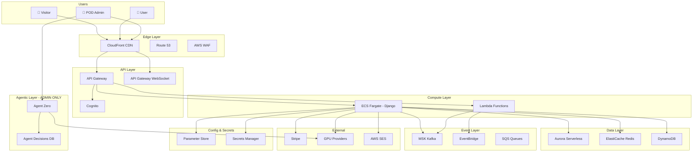
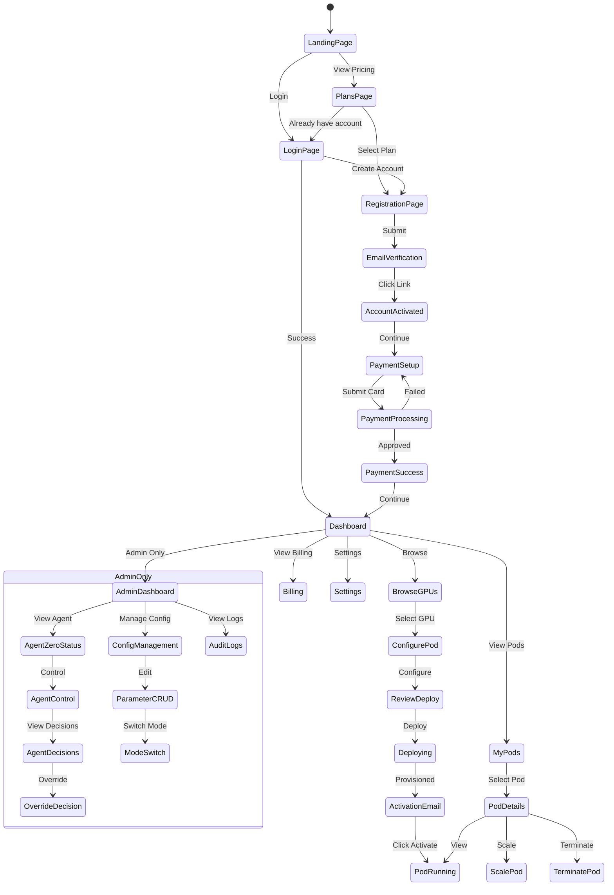

# Design Document: GPUBROKER POD SaaS Platform

## Overview

GPUBROKER POD is a complete SaaS platform built on 100% AWS Serverless infrastructure with an Agentic Layer powered by Agent Zero. The system supports SANDBOX and LIVE modes with full CRUD configuration per POD.

**Core Stack:**
- Django 5 + Django Ninja (API)
- AWS Serverless (Lambda, ECS Fargate, Aurora, ElastiCache, MSK)
- Agent Zero (Agentic Layer - ADMIN ONLY)
- Stripe (Payments - Sandbox/Live)
- AWS Cognito (Authentication)

**Deployment Modes:**
- SANDBOX: Test environment, no real charges
- LIVE: Production environment, real billing

---

## Architecture




---

## Component Architecture

### 1. Configuration System (CRUD per POD)

```python
# backend/gpubroker/apps/config/models.py

from django.db import models
from django.contrib.auth import get_user_model
import json

class PodConfiguration(models.Model):
    """
    GPUBROKER POD Configuration with CRUD operations.
    All settings are parameters - SANDBOX vs LIVE modes.
    """
    
    class Mode(models.TextChoices):
        SANDBOX = 'sandbox', 'Sandbox (Testing)'
        LIVE = 'live', 'Live (Production)'
    
    pod_id = models.CharField(max_length=64, unique=True, db_index=True)
    name = models.CharField(max_length=255)
    mode = models.CharField(max_length=10, choices=Mode.choices, default=Mode.SANDBOX)
    
    # AWS Configuration
    aws_region = models.CharField(max_length=20, default='us-east-1')
    aws_account_id = models.CharField(max_length=20)
    
    # Feature Flags
    agent_zero_enabled = models.BooleanField(default=False)
    websocket_enabled = models.BooleanField(default=True)
    webhooks_enabled = models.BooleanField(default=True)
    
    # Rate Limits (per mode)
    rate_limit_free = models.IntegerField(default=10)  # RPS
    rate_limit_pro = models.IntegerField(default=100)
    rate_limit_enterprise = models.IntegerField(default=1000)
    
    # Billing
    markup_percentage = models.DecimalField(max_digits=5, decimal_places=2, default=10.00)
    
    created_at = models.DateTimeField(auto_now_add=True)
    updated_at = models.DateTimeField(auto_now=True)
    
    class Meta:
        db_table = 'pod_configurations'


class PodParameter(models.Model):
    """
    Individual parameter for a POD with mode-specific values.
    Supports hot-reload without restart.
    """
    
    class ParameterType(models.TextChoices):
        STRING = 'string', 'String'
        INTEGER = 'integer', 'Integer'
        BOOLEAN = 'boolean', 'Boolean'
        JSON = 'json', 'JSON'
        SECRET = 'secret', 'Secret (Encrypted)'
    
    pod = models.ForeignKey(PodConfiguration, on_delete=models.CASCADE, related_name='parameters')
    key = models.CharField(max_length=255)
    
    # Mode-specific values
    sandbox_value = models.TextField(blank=True, null=True)
    live_value = models.TextField(blank=True, null=True)
    
    parameter_type = models.CharField(max_length=10, choices=ParameterType.choices, default=ParameterType.STRING)
    description = models.TextField(blank=True)
    is_sensitive = models.BooleanField(default=False)
    
    # AWS Parameter Store ARN (for secrets)
    aws_parameter_arn = models.CharField(max_length=255, blank=True, null=True)
    
    created_at = models.DateTimeField(auto_now_add=True)
    updated_at = models.DateTimeField(auto_now=True)
    
    class Meta:
        db_table = 'pod_parameters'
        unique_together = ['pod', 'key']


class ParameterAuditLog(models.Model):
    """
    Audit log for all parameter changes.
    """
    
    parameter = models.ForeignKey(PodParameter, on_delete=models.CASCADE, related_name='audit_logs')
    changed_by = models.ForeignKey(get_user_model(), on_delete=models.SET_NULL, null=True)
    
    old_value = models.TextField(blank=True, null=True)
    new_value = models.TextField(blank=True, null=True)
    mode_affected = models.CharField(max_length=10)  # sandbox, live, both
    
    change_reason = models.TextField(blank=True)
    ip_address = models.GenericIPAddressField(null=True)
    user_agent = models.TextField(blank=True)
    
    created_at = models.DateTimeField(auto_now_add=True)
    
    class Meta:
        db_table = 'parameter_audit_logs'
        ordering = ['-created_at']
```


### 2. Configuration API (CRUD)

```python
# backend/gpubroker/apps/config/api.py

from ninja import Router, Schema
from ninja.security import HttpBearer
from typing import List, Optional
from django.shortcuts import get_object_or_404
from .models import PodConfiguration, PodParameter, ParameterAuditLog

router = Router(tags=["Configuration"])


class PodConfigSchema(Schema):
    pod_id: str
    name: str
    mode: str
    aws_region: str
    agent_zero_enabled: bool
    websocket_enabled: bool
    webhooks_enabled: bool
    rate_limit_free: int
    rate_limit_pro: int
    rate_limit_enterprise: int
    markup_percentage: float


class ParameterSchema(Schema):
    key: str
    sandbox_value: Optional[str]
    live_value: Optional[str]
    parameter_type: str
    description: str
    is_sensitive: bool


class ParameterCreateSchema(Schema):
    key: str
    sandbox_value: Optional[str] = None
    live_value: Optional[str] = None
    parameter_type: str = 'string'
    description: str = ''
    is_sensitive: bool = False


class ParameterUpdateSchema(Schema):
    sandbox_value: Optional[str] = None
    live_value: Optional[str] = None
    description: Optional[str] = None
    change_reason: str = ''


# POD Configuration CRUD

@router.get("/pods", response=List[PodConfigSchema])
def list_pods(request):
    """List all POD configurations (ADMIN ONLY)."""
    return PodConfiguration.objects.all()


@router.get("/pods/{pod_id}", response=PodConfigSchema)
def get_pod(request, pod_id: str):
    """Get POD configuration by ID."""
    return get_object_or_404(PodConfiguration, pod_id=pod_id)


@router.post("/pods", response=PodConfigSchema)
def create_pod(request, data: PodConfigSchema):
    """Create new POD configuration (ADMIN ONLY)."""
    pod = PodConfiguration.objects.create(**data.dict())
    return pod


@router.put("/pods/{pod_id}", response=PodConfigSchema)
def update_pod(request, pod_id: str, data: PodConfigSchema):
    """Update POD configuration (ADMIN ONLY)."""
    pod = get_object_or_404(PodConfiguration, pod_id=pod_id)
    for key, value in data.dict().items():
        setattr(pod, key, value)
    pod.save()
    return pod


@router.delete("/pods/{pod_id}")
def delete_pod(request, pod_id: str):
    """Delete POD configuration (ADMIN ONLY)."""
    pod = get_object_or_404(PodConfiguration, pod_id=pod_id)
    pod.delete()
    return {"success": True}


# Parameter CRUD

@router.get("/pods/{pod_id}/parameters", response=List[ParameterSchema])
def list_parameters(request, pod_id: str):
    """List all parameters for a POD."""
    pod = get_object_or_404(PodConfiguration, pod_id=pod_id)
    return pod.parameters.all()


@router.get("/pods/{pod_id}/parameters/{key}", response=ParameterSchema)
def get_parameter(request, pod_id: str, key: str):
    """Get specific parameter."""
    pod = get_object_or_404(PodConfiguration, pod_id=pod_id)
    return get_object_or_404(PodParameter, pod=pod, key=key)


@router.post("/pods/{pod_id}/parameters", response=ParameterSchema)
def create_parameter(request, pod_id: str, data: ParameterCreateSchema):
    """Create new parameter for POD."""
    pod = get_object_or_404(PodConfiguration, pod_id=pod_id)
    param = PodParameter.objects.create(pod=pod, **data.dict())
    
    # Sync to AWS Parameter Store if sensitive
    if data.is_sensitive:
        _sync_to_aws_parameter_store(param)
    
    return param


@router.put("/pods/{pod_id}/parameters/{key}", response=ParameterSchema)
def update_parameter(request, pod_id: str, key: str, data: ParameterUpdateSchema):
    """Update parameter with audit logging."""
    pod = get_object_or_404(PodConfiguration, pod_id=pod_id)
    param = get_object_or_404(PodParameter, pod=pod, key=key)
    
    # Create audit log
    ParameterAuditLog.objects.create(
        parameter=param,
        changed_by=request.user,
        old_value=param.sandbox_value if data.sandbox_value else param.live_value,
        new_value=data.sandbox_value or data.live_value,
        mode_affected='sandbox' if data.sandbox_value else 'live',
        change_reason=data.change_reason,
        ip_address=request.META.get('REMOTE_ADDR'),
        user_agent=request.META.get('HTTP_USER_AGENT', ''),
    )
    
    # Update parameter
    if data.sandbox_value is not None:
        param.sandbox_value = data.sandbox_value
    if data.live_value is not None:
        param.live_value = data.live_value
    if data.description is not None:
        param.description = data.description
    param.save()
    
    # Sync to AWS if sensitive
    if param.is_sensitive:
        _sync_to_aws_parameter_store(param)
    
    return param


@router.delete("/pods/{pod_id}/parameters/{key}")
def delete_parameter(request, pod_id: str, key: str):
    """Delete parameter."""
    pod = get_object_or_404(PodConfiguration, pod_id=pod_id)
    param = get_object_or_404(PodParameter, pod=pod, key=key)
    param.delete()
    return {"success": True}


# Mode Switching

@router.post("/pods/{pod_id}/switch-mode")
def switch_mode(request, pod_id: str, mode: str, confirmation: str):
    """
    Switch POD between SANDBOX and LIVE modes.
    Requires confirmation string for LIVE mode.
    """
    pod = get_object_or_404(PodConfiguration, pod_id=pod_id)
    
    if mode == 'live' and confirmation != f"SWITCH-{pod_id}-TO-LIVE":
        return {"error": "Invalid confirmation for LIVE mode switch"}
    
    old_mode = pod.mode
    pod.mode = mode
    pod.save()
    
    # Log mode switch
    ParameterAuditLog.objects.create(
        parameter=None,
        changed_by=request.user,
        old_value=old_mode,
        new_value=mode,
        mode_affected='both',
        change_reason=f"Mode switch from {old_mode} to {mode}",
        ip_address=request.META.get('REMOTE_ADDR'),
    )
    
    return {"success": True, "mode": mode}
```


### 3. Agent Zero Integration (ADMIN ONLY)

```python
# backend/gpubroker/apps/agentic/agent_zero_service.py

"""
Agent Zero Integration for GPUBROKER POD.
ADMIN ONLY - Autonomous AI agent for GPU/Service procurement.

Agent Zero source: TMP/agent-zero (gitignored)
"""

import logging
import asyncio
from typing import Dict, Any, List, Optional
from dataclasses import dataclass
from datetime import datetime, timezone
from enum import Enum
from django.conf import settings

logger = logging.getLogger('gpubroker.agentic')


class AgentStatus(Enum):
    STOPPED = 'stopped'
    STARTING = 'starting'
    RUNNING = 'running'
    PAUSED = 'paused'
    ERROR = 'error'


@dataclass
class AgentDecision:
    """Record of an autonomous decision made by Agent Zero."""
    decision_id: str
    timestamp: datetime
    action_type: str  # provision, scale, terminate, optimize
    target_resource: str
    provider: str
    reasoning: str
    estimated_cost: float
    actual_cost: Optional[float]
    status: str  # pending, approved, executed, rejected, failed
    admin_override: bool
    admin_notes: Optional[str]


class AgentZeroService:
    """
    Service for managing Agent Zero integration.
    
    ADMIN ONLY ACCESS - Controls autonomous GPU procurement.
    """
    
    def __init__(self, pod_id: str):
        self.pod_id = pod_id
        self.status = AgentStatus.STOPPED
        self.budget_limit: float = 0.0
        self.decisions: List[AgentDecision] = []
        self._agent_instance = None
    
    async def start(self, budget_limit: float) -> Dict[str, Any]:
        """
        Start Agent Zero with budget limit.
        ADMIN ONLY.
        """
        if self.status == AgentStatus.RUNNING:
            return {"error": "Agent already running"}
        
        self.budget_limit = budget_limit
        self.status = AgentStatus.STARTING
        
        try:
            # Initialize Agent Zero from TMP/agent-zero
            # This is a placeholder - actual integration depends on Agent Zero API
            self._agent_instance = await self._initialize_agent()
            self.status = AgentStatus.RUNNING
            
            logger.info(f"Agent Zero started for POD {self.pod_id} with budget ${budget_limit}")
            
            return {
                "status": "running",
                "budget_limit": budget_limit,
                "pod_id": self.pod_id
            }
        except Exception as e:
            self.status = AgentStatus.ERROR
            logger.error(f"Failed to start Agent Zero: {e}")
            return {"error": str(e)}
    
    async def stop(self) -> Dict[str, Any]:
        """Stop Agent Zero. ADMIN ONLY."""
        if self.status != AgentStatus.RUNNING:
            return {"error": "Agent not running"}
        
        self.status = AgentStatus.STOPPED
        self._agent_instance = None
        
        logger.info(f"Agent Zero stopped for POD {self.pod_id}")
        return {"status": "stopped"}
    
    async def pause(self) -> Dict[str, Any]:
        """Pause Agent Zero (no new decisions). ADMIN ONLY."""
        if self.status != AgentStatus.RUNNING:
            return {"error": "Agent not running"}
        
        self.status = AgentStatus.PAUSED
        logger.info(f"Agent Zero paused for POD {self.pod_id}")
        return {"status": "paused"}
    
    async def resume(self) -> Dict[str, Any]:
        """Resume Agent Zero. ADMIN ONLY."""
        if self.status != AgentStatus.PAUSED:
            return {"error": "Agent not paused"}
        
        self.status = AgentStatus.RUNNING
        logger.info(f"Agent Zero resumed for POD {self.pod_id}")
        return {"status": "running"}
    
    async def get_status(self) -> Dict[str, Any]:
        """Get Agent Zero status. ADMIN ONLY."""
        return {
            "status": self.status.value,
            "pod_id": self.pod_id,
            "budget_limit": self.budget_limit,
            "budget_used": await self._calculate_budget_used(),
            "decisions_count": len(self.decisions),
            "pending_decisions": len([d for d in self.decisions if d.status == 'pending']),
        }
    
    async def get_decisions(self, limit: int = 100) -> List[Dict[str, Any]]:
        """Get recent decisions. ADMIN ONLY."""
        return [
            {
                "decision_id": d.decision_id,
                "timestamp": d.timestamp.isoformat(),
                "action_type": d.action_type,
                "target_resource": d.target_resource,
                "provider": d.provider,
                "reasoning": d.reasoning,
                "estimated_cost": d.estimated_cost,
                "actual_cost": d.actual_cost,
                "status": d.status,
                "admin_override": d.admin_override,
            }
            for d in self.decisions[-limit:]
        ]
    
    async def override_decision(
        self, 
        decision_id: str, 
        action: str,  # approve, reject
        notes: str
    ) -> Dict[str, Any]:
        """
        Override an agent decision. ADMIN ONLY.
        """
        decision = next((d for d in self.decisions if d.decision_id == decision_id), None)
        if not decision:
            return {"error": "Decision not found"}
        
        decision.admin_override = True
        decision.admin_notes = notes
        
        if action == 'approve':
            decision.status = 'approved'
            # Execute the decision
            await self._execute_decision(decision)
        elif action == 'reject':
            decision.status = 'rejected'
        
        logger.info(f"Decision {decision_id} {action}ed by admin: {notes}")
        return {"success": True, "decision_id": decision_id, "status": decision.status}
    
    async def set_budget_limit(self, new_limit: float) -> Dict[str, Any]:
        """Update budget limit. ADMIN ONLY."""
        old_limit = self.budget_limit
        self.budget_limit = new_limit
        logger.info(f"Budget limit changed from ${old_limit} to ${new_limit}")
        return {"budget_limit": new_limit}
    
    # Private methods
    
    async def _initialize_agent(self):
        """Initialize Agent Zero instance."""
        # Placeholder for Agent Zero initialization
        # Actual implementation depends on Agent Zero API
        pass
    
    async def _calculate_budget_used(self) -> float:
        """Calculate total budget used by executed decisions."""
        return sum(
            d.actual_cost or d.estimated_cost 
            for d in self.decisions 
            if d.status == 'executed'
        )
    
    async def _execute_decision(self, decision: AgentDecision):
        """Execute an approved decision."""
        # Placeholder for decision execution
        decision.status = 'executed'
        logger.info(f"Executed decision {decision.decision_id}: {decision.action_type}")


# Singleton per POD
_agent_services: Dict[str, AgentZeroService] = {}


def get_agent_service(pod_id: str) -> AgentZeroService:
    """Get Agent Zero service for a POD."""
    if pod_id not in _agent_services:
        _agent_services[pod_id] = AgentZeroService(pod_id)
    return _agent_services[pod_id]
```


### 4. AWS Serverless Infrastructure

```yaml
# infrastructure/aws/serverless.yml
# AWS SAM/CloudFormation template for GPUBROKER POD

AWSTemplateFormatVersion: '2010-09-09'
Transform: AWS::Serverless-2016-10-31
Description: GPUBROKER POD - 100% AWS Serverless Infrastructure

Parameters:
  Environment:
    Type: String
    AllowedValues: [sandbox, live]
    Default: sandbox
  
  PodId:
    Type: String
    Description: Unique POD identifier

Globals:
  Function:
    Runtime: python3.11
    Timeout: 30
    MemorySize: 512
    Environment:
      Variables:
        GPUBROKER_MODE: !Ref Environment
        POD_ID: !Ref PodId

Resources:
  # ============================================
  # API Gateway
  # ============================================
  
  ApiGateway:
    Type: AWS::Serverless::Api
    Properties:
      Name: !Sub gpubroker-${PodId}-api
      StageName: !Ref Environment
      Cors:
        AllowOrigin: "'*'"
        AllowMethods: "'GET,POST,PUT,DELETE,OPTIONS'"
        AllowHeaders: "'Content-Type,Authorization'"
      Auth:
        DefaultAuthorizer: CognitoAuthorizer
        Authorizers:
          CognitoAuthorizer:
            UserPoolArn: !GetAtt CognitoUserPool.Arn
  
  WebSocketApi:
    Type: AWS::ApiGatewayV2::Api
    Properties:
      Name: !Sub gpubroker-${PodId}-websocket
      ProtocolType: WEBSOCKET
      RouteSelectionExpression: "$request.body.action"
  
  # ============================================
  # Cognito (Authentication)
  # ============================================
  
  CognitoUserPool:
    Type: AWS::Cognito::UserPool
    Properties:
      UserPoolName: !Sub gpubroker-${PodId}-users
      AutoVerifiedAttributes:
        - email
      UsernameAttributes:
        - email
      Policies:
        PasswordPolicy:
          MinimumLength: 8
          RequireLowercase: true
          RequireUppercase: true
          RequireNumbers: true
          RequireSymbols: false
      MfaConfiguration: OPTIONAL
      EnabledMfas:
        - SOFTWARE_TOKEN_MFA
  
  CognitoUserPoolClient:
    Type: AWS::Cognito::UserPoolClient
    Properties:
      UserPoolId: !Ref CognitoUserPool
      ClientName: !Sub gpubroker-${PodId}-client
      GenerateSecret: false
      ExplicitAuthFlows:
        - ALLOW_USER_PASSWORD_AUTH
        - ALLOW_REFRESH_TOKEN_AUTH
        - ALLOW_USER_SRP_AUTH
  
  # ============================================
  # ECS Fargate (Django Application)
  # ============================================
  
  ECSCluster:
    Type: AWS::ECS::Cluster
    Properties:
      ClusterName: !Sub gpubroker-${PodId}-cluster
      CapacityProviders:
        - FARGATE
        - FARGATE_SPOT
      DefaultCapacityProviderStrategy:
        - CapacityProvider: FARGATE
          Weight: 1
        - CapacityProvider: FARGATE_SPOT
          Weight: 3
  
  DjangoTaskDefinition:
    Type: AWS::ECS::TaskDefinition
    Properties:
      Family: !Sub gpubroker-${PodId}-django
      Cpu: '512'
      Memory: '1024'
      NetworkMode: awsvpc
      RequiresCompatibilities:
        - FARGATE
      ExecutionRoleArn: !GetAtt ECSExecutionRole.Arn
      TaskRoleArn: !GetAtt ECSTaskRole.Arn
      ContainerDefinitions:
        - Name: django
          Image: !Sub ${AWS::AccountId}.dkr.ecr.${AWS::Region}.amazonaws.com/gpubroker-django:latest
          PortMappings:
            - ContainerPort: 8000
          Environment:
            - Name: GPUBROKER_MODE
              Value: !Ref Environment
            - Name: POD_ID
              Value: !Ref PodId
          Secrets:
            - Name: DATABASE_URL
              ValueFrom: !Ref DatabaseUrlSecret
            - Name: STRIPE_SECRET_KEY
              ValueFrom: !Ref StripeSecretKey
          LogConfiguration:
            LogDriver: awslogs
            Options:
              awslogs-group: !Ref DjangoLogGroup
              awslogs-region: !Ref AWS::Region
              awslogs-stream-prefix: django
  
  DjangoService:
    Type: AWS::ECS::Service
    Properties:
      ServiceName: !Sub gpubroker-${PodId}-django
      Cluster: !Ref ECSCluster
      TaskDefinition: !Ref DjangoTaskDefinition
      DesiredCount: 2
      LaunchType: FARGATE
      NetworkConfiguration:
        AwsvpcConfiguration:
          Subnets:
            - !Ref PrivateSubnet1
            - !Ref PrivateSubnet2
          SecurityGroups:
            - !Ref DjangoSecurityGroup
      LoadBalancers:
        - ContainerName: django
          ContainerPort: 8000
          TargetGroupArn: !Ref DjangoTargetGroup
  
  # Auto Scaling
  DjangoAutoScaling:
    Type: AWS::ApplicationAutoScaling::ScalableTarget
    Properties:
      MaxCapacity: 100
      MinCapacity: 2
      ResourceId: !Sub service/${ECSCluster}/${DjangoService.Name}
      RoleARN: !GetAtt AutoScalingRole.Arn
      ScalableDimension: ecs:service:DesiredCount
      ServiceNamespace: ecs
  
  DjangoScalingPolicy:
    Type: AWS::ApplicationAutoScaling::ScalingPolicy
    Properties:
      PolicyName: DjangoCPUScaling
      PolicyType: TargetTrackingScaling
      ScalingTargetId: !Ref DjangoAutoScaling
      TargetTrackingScalingPolicyConfiguration:
        PredefinedMetricSpecification:
          PredefinedMetricType: ECSServiceAverageCPUUtilization
        TargetValue: 70
        ScaleInCooldown: 60
        ScaleOutCooldown: 60
  
  # ============================================
  # Aurora Serverless v2 (Database)
  # ============================================
  
  AuroraCluster:
    Type: AWS::RDS::DBCluster
    Properties:
      DBClusterIdentifier: !Sub gpubroker-${PodId}-db
      Engine: aurora-postgresql
      EngineVersion: '15.4'
      EngineMode: provisioned
      ServerlessV2ScalingConfiguration:
        MinCapacity: 0.5
        MaxCapacity: 64
      MasterUsername: !Sub '{{resolve:secretsmanager:${DatabaseCredentials}:SecretString:username}}'
      MasterUserPassword: !Sub '{{resolve:secretsmanager:${DatabaseCredentials}:SecretString:password}}'
      DatabaseName: gpubroker
      VpcSecurityGroupIds:
        - !Ref DatabaseSecurityGroup
      DBSubnetGroupName: !Ref DatabaseSubnetGroup
      EnableHttpEndpoint: true
      StorageEncrypted: true
      KmsKeyId: !Ref KMSKey
  
  AuroraInstance:
    Type: AWS::RDS::DBInstance
    Properties:
      DBClusterIdentifier: !Ref AuroraCluster
      DBInstanceClass: db.serverless
      Engine: aurora-postgresql
  
  # ============================================
  # ElastiCache (Redis)
  # ============================================
  
  RedisCluster:
    Type: AWS::ElastiCache::ReplicationGroup
    Properties:
      ReplicationGroupId: !Sub gpubroker-${PodId}-redis
      ReplicationGroupDescription: GPUBROKER Redis Cluster
      Engine: redis
      EngineVersion: '7.0'
      CacheNodeType: cache.t4g.medium
      NumCacheClusters: 2
      AutomaticFailoverEnabled: true
      MultiAZEnabled: true
      AtRestEncryptionEnabled: true
      TransitEncryptionEnabled: true
      SecurityGroupIds:
        - !Ref RedisSecurityGroup
      CacheSubnetGroupName: !Ref RedisSubnetGroup
  
  # ============================================
  # MSK Serverless (Kafka)
  # ============================================
  
  MSKCluster:
    Type: AWS::MSK::ServerlessCluster
    Properties:
      ClusterName: !Sub gpubroker-${PodId}-kafka
      ClientAuthentication:
        Sasl:
          Iam:
            Enabled: true
      VpcConfigs:
        - SubnetIds:
            - !Ref PrivateSubnet1
            - !Ref PrivateSubnet2
          SecurityGroups:
            - !Ref KafkaSecurityGroup
  
  # ============================================
  # Secrets Manager
  # ============================================
  
  DatabaseCredentials:
    Type: AWS::SecretsManager::Secret
    Properties:
      Name: !Sub gpubroker/${PodId}/database
      GenerateSecretString:
        SecretStringTemplate: '{"username": "gpubroker"}'
        GenerateStringKey: password
        PasswordLength: 32
        ExcludeCharacters: '"@/\'
  
  StripeSecretKey:
    Type: AWS::SecretsManager::Secret
    Properties:
      Name: !Sub gpubroker/${PodId}/stripe/${Environment}
      Description: Stripe API key (sandbox or live)
  
  ProviderCredentials:
    Type: AWS::SecretsManager::Secret
    Properties:
      Name: !Sub gpubroker/${PodId}/providers/${Environment}
      Description: GPU Provider API keys

Outputs:
  ApiEndpoint:
    Value: !Sub https://${ApiGateway}.execute-api.${AWS::Region}.amazonaws.com/${Environment}
  
  WebSocketEndpoint:
    Value: !Sub wss://${WebSocketApi}.execute-api.${AWS::Region}.amazonaws.com/${Environment}
  
  CognitoUserPoolId:
    Value: !Ref CognitoUserPool
  
  CognitoClientId:
    Value: !Ref CognitoUserPoolClient
```


### 5. User Journey Screens - State Diagram



### 6. Screen Wireframes

#### Screen: Landing Page
```
┌─────────────────────────────────────────────────────────────────────────────┐
│  🚀 GPUBROKER                                          [Login] [Get Started]│
├─────────────────────────────────────────────────────────────────────────────┤
│                                                                             │
│  ┌─────────────────────────────────────────────────────────────────────┐   │
│  │                                                                      │   │
│  │     Access ANY GPU from ANY Provider                                 │   │
│  │     One Platform. Best Prices. Instant Deployment.                   │   │
│  │                                                                      │   │
│  │     [  Get Started Free  ]    [  View Pricing  ]                     │   │
│  │                                                                      │   │
│  └─────────────────────────────────────────────────────────────────────┘   │
│                                                                             │
│  ┌─────────────────────────────────────────────────────────────────────┐   │
│  │  LIVE GPU PRICING                                    🔴 Real-time    │   │
│  │  ─────────────────────────────────────────────────────────────────  │   │
│  │  GPU          │ Best Price │ Provider  │ Availability               │   │
│  │  RTX 4090     │ $0.35/hr   │ Vast.ai   │ ████████░░ 80%             │   │
│  │  A100 80GB    │ $1.89/hr   │ RunPod    │ ██████████ 100%            │   │
│  │  H100         │ $2.49/hr   │ Lambda    │ ██████░░░░ 60%             │   │
│  │                                                                      │   │
│  │  [  View All 500+ GPUs  ]                                            │   │
│  └─────────────────────────────────────────────────────────────────────┘   │
│                                                                             │
│  ┌─────────────────────────────────────────────────────────────────────┐   │
│  │  TRUSTED BY 20+ PROVIDERS                                            │   │
│  │  [RunPod] [Vast.ai] [AWS] [Azure] [GCP] [Lambda] [CoreWeave] ...    │   │
│  └─────────────────────────────────────────────────────────────────────┘   │
│                                                                             │
└─────────────────────────────────────────────────────────────────────────────┘
```

#### Screen: Dashboard
```
┌─────────────────────────────────────────────────────────────────────────────┐
│  🚀 GPUBROKER    [Dashboard] [Browse] [Billing] [Settings]    👤 John Doe  │
├─────────────────────────────────────────────────────────────────────────────┤
│                                                                             │
│  Welcome back, John!                                     Plan: PRO ($49/mo) │
│                                                                             │
│  ┌─────────────────────────────────────────────────────────────────────┐   │
│  │  QUICK STATS                                                         │   │
│  │  ┌─────────────┐ ┌─────────────┐ ┌─────────────┐ ┌─────────────┐    │   │
│  │  │ Active Pods │ │ This Month  │ │ API Calls   │ │ Savings     │    │   │
│  │  │     3       │ │   $127.50   │ │   45,230    │ │    23%      │    │   │
│  │  └─────────────┘ └─────────────┘ └─────────────┘ └─────────────┘    │   │
│  └─────────────────────────────────────────────────────────────────────┘   │
│                                                                             │
│  ┌─────────────────────────────────────────────────────────────────────┐   │
│  │  MY PODS                                           [+ Deploy New Pod]│   │
│  │  ─────────────────────────────────────────────────────────────────  │   │
│  │  Name          │ GPU       │ Provider │ Status   │ Cost/hr │ Action │   │
│  │  ml-training   │ A100 80GB │ RunPod   │ 🟢 Running│ $1.89   │ [...]  │   │
│  │  inference-1   │ RTX 4090  │ Vast.ai  │ 🟢 Running│ $0.35   │ [...]  │   │
│  │  dev-server    │ RTX 3090  │ Lambda   │ 🟡 Paused │ $0.00   │ [...]  │   │
│  └─────────────────────────────────────────────────────────────────────┘   │
│                                                                             │
│  ┌─────────────────────────────────────────────────────────────────────┐   │
│  │  RECENT ACTIVITY                                                     │   │
│  │  • 2 min ago: Pod ml-training scaled to 2x A100                     │   │
│  │  • 1 hour ago: Price alert triggered for H100 < $2.50               │   │
│  │  • 3 hours ago: Pod inference-1 deployed                            │   │
│  └─────────────────────────────────────────────────────────────────────┘   │
│                                                                             │
└─────────────────────────────────────────────────────────────────────────────┘
```

#### Screen: Admin Dashboard (POD Admin Only)
```
┌─────────────────────────────────────────────────────────────────────────────┐
│  🚀 GPUBROKER ADMIN    [Dashboard] [Agent Zero] [Config] [Audit]   👑 Admin│
├─────────────────────────────────────────────────────────────────────────────┤
│                                                                             │
│  POD: gpubroker-prod-001                    Mode: [SANDBOX] / [LIVE] ←     │
│                                                                             │
│  ┌─────────────────────────────────────────────────────────────────────┐   │
│  │  AGENT ZERO STATUS                                                   │   │
│  │  ┌─────────────────────────────────────────────────────────────────┐│   │
│  │  │  Status: 🟢 RUNNING          Budget: $5,000 / $10,000 used      ││   │
│  │  │  Decisions Today: 47         Pending Approval: 3                ││   │
│  │  │                                                                  ││   │
│  │  │  [Pause Agent]  [Stop Agent]  [View Decisions]  [Set Budget]    ││   │
│  │  └─────────────────────────────────────────────────────────────────┘│   │
│  └─────────────────────────────────────────────────────────────────────┘   │
│                                                                             │
│  ┌─────────────────────────────────────────────────────────────────────┐   │
│  │  PENDING AGENT DECISIONS                                             │   │
│  │  ─────────────────────────────────────────────────────────────────  │   │
│  │  ID      │ Action    │ Resource  │ Est. Cost │ Reasoning   │ Action │   │
│  │  DEC-001 │ Provision │ 4x H100   │ $9.96/hr  │ ML training │[✓] [✗] │   │
│  │  DEC-002 │ Scale     │ +2 A100   │ $3.78/hr  │ Load spike  │[✓] [✗] │   │
│  │  DEC-003 │ Terminate │ RTX 3090  │ -$0.50/hr │ Idle 2hrs   │[✓] [✗] │   │
│  └─────────────────────────────────────────────────────────────────────┘   │
│                                                                             │
│  ┌─────────────────────────────────────────────────────────────────────┐   │
│  │  SYSTEM METRICS (AWS CloudWatch)                                     │   │
│  │  ┌─────────────┐ ┌─────────────┐ ┌─────────────┐ ┌─────────────┐    │   │
│  │  │ API Latency │ │ Error Rate  │ │ Active Users│ │ AWS Cost    │    │   │
│  │  │   45ms P99  │ │   0.02%     │ │    1,234    │ │  $89.50/day │    │   │
│  │  └─────────────┘ └─────────────┘ └─────────────┘ └─────────────┘    │   │
│  └─────────────────────────────────────────────────────────────────────┘   │
│                                                                             │
└─────────────────────────────────────────────────────────────────────────────┘
```

