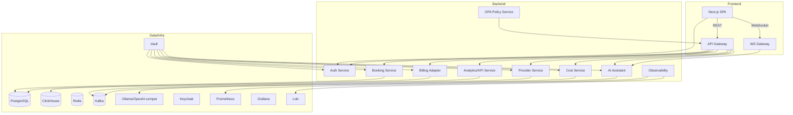
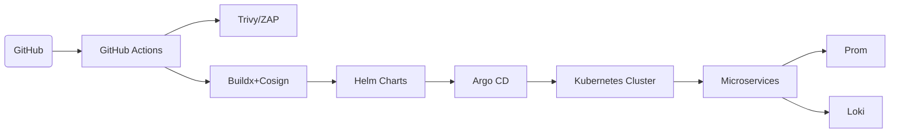

# Software Requirements Specification (SRS)
GOUBROKER — AI‑Powered GPU & Cloud‑Instance Marketplace

Document Version: 1.0.0  
Date: 2025‑11‑03  
Status: Baseline  
Owner: Agent Zero (agent0)  
Standards: ISO/IEC/IEEE 29148, ISO/IEC 25010, ISO/IEC 27001, ISO/IEC 12207

Note on naming: GOUBROKER (aka “GPU Broker”, “GPUBROKER”) is the project codename. All references refer to the same SaaS.

## 1. Introduction
### 1.1 Purpose
Define the complete, testable requirements for GOUBROKER, a SaaS marketplace that aggregates GPU/AI compute from multiple providers, normalizes catalogs, offers AI-assisted recommendations and cost forecasts, and enables booking, billing, analytics, and compliance operations. This SRS serves as the single source of truth for implementation, testing, and audit.

### 1.2 Scope
- Deliver a multi-tenant web app and API:
  - Backend microservices: Auth, Provider Aggregator, AI Assistant, Cost Prediction, Booking, Billing Integration, Analytics/KPI, Observability, Security/Policy.
  - Frontend: Next.js SPA with marketplace, AI chat, admin console, and wizards.
  - Infra: Docker, Kubernetes, Helm, GitHub Actions CI/CD, observability (Prometheus/Grafana/Loki), secrets (Vault), OPA policies.
  - Integrations: Cloud providers (≥15), Identity (OIDC), Payments (Kill Bill), Metrics (Prometheus), Logs (Loki).
- Excludes: Hardware procurement, provider SLA negotiations, marketing.

### 1.3 Definitions
- Adapter: Code that translates a provider API into the platform schema.
- Offer: A normalized GPU/AI instance SKU with price, region, capacity.
- Tenant: Logical isolation unit (organization) in the platform.
- LLM: Large Language Model used for AI recommendations.

### 1.4 References
- ISO/IEC/IEEE 29148, ISO/IEC 25010, ISO/IEC 27001.
- FastAPI, Next.js, ClickHouse, PostgreSQL, Redis, Kafka, Keycloak, Vault, OPA.

## 2. Overall Description
### 2.1 Product Perspective
- Stand-alone SaaS on Kubernetes.  
- Aggregates provider catalogs via adapters.  
- AI assistant guides selection and cost optimization.  
- Booking and billing automate reservations and invoicing.  
- Observability and compliance integrated end-to-end.

### 2.2 Product Functions (high-level)
- Authentication & RBAC (OIDC, MFA, JWT).
- Provider aggregation and normalization.
- Marketplace search with filters/sort/pagination/cache.
- AI recommendation (providers, costs, Terraform/IaC snippet).
- Cost forecasting (30-day short-term).
- Booking/reservations with webhooks and status updates.
- Billing integration (Kill Bill): usage ingestion, invoices.
- Analytics/KPIs: spend, utilization, provider health.
- Observability: metrics/logs/traces; health checks.
- Compliance: audit log, GDPR export, rate limiting, policies.

### 2.3 User Classes
- End‑User: DS/ML teams booking compute.
- Admin: Platform operators (tenant + system).
- Auditor/Security: Compliance, audit, GDPR requests.
- Third‑Party Developer: Integrates via API/SDK.

### 2.4 Operating Environment
- Kubernetes 1.28+, Docker 24+, Linux containers (Debian-based).
- Datastores: PostgreSQL 15 (OLTP), ClickHouse 23 (analytics).
- Cache: Redis 7 cluster; Queue/Bus: Kafka 3.5 (or Redpanda).
- AI runtime: Ollama or OpenAI-compatible endpoint.
- Browsers: Latest Chrome/Edge/Firefox.

### 2.5 Constraints
- Open-source stack only.
- Containerized and Helm-deployable.
- Python 3.12 backend, TypeScript 5 frontend.
- GitHub Actions pipelines.

### 2.6 Assumptions
- Provider APIs expose catalog/price via REST/GraphQL.
- Stripe-style payments via Kill Bill integration available.
- Tenants use modern browsers and stable connectivity.

## 3. Specific Requirements
IDs use FR- for functional; NFR- for non-functional; SEC-/COMP- for security/compliance.

### 3.1 Functional Requirements
Auth and RBAC
- FR-AUTH-1 Registration/Login/OIDC: Email/password, OIDC social login; JWT issuance with sub, role, tenant_id; refresh tokens.
  - AC: POST /auth/login issues access+refresh; JWT validates; OIDC callback succeeds; 401 on invalid.
- FR-AUTH-2 MFA: TOTP and WebAuthn enrollment/verification.
  - AC: Users can enroll TOTP/WebAuthn; login requires second factor if enabled.
- FR-AUTH-3 Roles: Roles admin, manager, user, auditor with route-level enforcement.
  - AC: Unauthorized action returns 403; UI hides forbidden elements.

Provider Aggregation and Marketplace
- FR-PROV-1 Adapters: Normalize catalogs into schema {id, provider, name, gpu_type, vcpu, memory_gb, storage_gb, price_per_hour, currency, region, availability, tags, last_updated}.
  - AC: Adding a provider via registry makes offers appear after next sync (<5 min).
- FR-PROV-2 Sync Pipeline: Ingest ≥5k records/min; upsert to gpu_offers; append to price_history; update health.
  - AC: Sync job reports throughput and errors; duplicates prevented on (provider_id, external_id).
- FR-MKT-1 Marketplace Query: /providers with filters (gpu_type, region, max_price, availability, tags), sorting, pagination, full-text search on name/tags.
  - AC: Response shape {total, items}; supports 100k+ rows via DB+cache; latency ≤200 ms p95.
- FR-MKT-2 Export: CSV/JSON export (≤10k rows) reflecting current filters.
  - AC: File downloads ≤3 s; schema matches UI.

AI Assistance and Cost
- FR-AI-1 Chat: /ai/chat accepts natural-language request; responds with structured recommendation {providers[], cost_estimate, IaC snippet}.
  - AC: ≤2 s response; returns at least one matching provider.
- FR-COST-1 Forecast: /predict returns 30-day forecast for workload (gpu, hours, region).
  - AC: ≤10% MAPE on validation set; includes confidence intervals.

Booking and Billing
- FR-BOOK-1 Booking: Create reservations for offers; callback webhooks for provisioning; cancellation path.
  - AC: End-to-end booking completes ≤5 s; idempotent webhooks; cancellation revokes reservation and updates status.
- FR-BILL-1 Usage and Invoices: Usage ingested to Kill Bill; daily invoices; PDF available; email receipt.
  - AC: Booking produces a line item; invoice totals reconcile with usage.

Observability and Compliance
- FR-OBS-1 Metrics: /metrics Prometheus exposition; request latency, error rates, sync KPIs.
  - AC: Grafana dashboards show p95, error rate, cache hit rate, sync throughput.
- FR-SEC-1 GDPR Export: /data-request returns all personal data + audit entries.
  - AC: Complete JSON delivered ≤30 s; includes linked audit.
- FR-SEC-2 Rate Limiting: Per-tenant default 100 req/s; burst configurable.
  - AC: Excess requests yield 429 with Retry-After.

Developer Experience
- FR-CI-1 CI Gates: Lint, unit/integration tests, SAST (Bandit/Ruff), Trivy, coverage ≥80%.
  - AC: PR blocked until all checks pass.
- FR-DOC-1 OpenAPI+SDK: OpenAPI generated for gateway; SDKs for Python/TypeScript published on release.
  - AC: SDKs compile and include examples.

### 3.2 Non‑Functional Requirements
Performance
- NFR-PERF-1 Marketplace latency ≤200 ms p95 (cached).
- NFR-PERF-2 AI chat ≤2 s end-to-end (LLM included).
- NFR-PERF-3 Concurrency: 10,000 concurrent users, ≤5% error rate.
- NFR-PERF-4 Ingestion: ≥5,000 records/min sustained.

Security and Privacy
- SEC-ENCRYPT-1 TLS 1.3 for all external traffic; mTLS for internal (service mesh).
- SEC-SECRETS-1 Secrets in Vault only; no plaintext in code or images.
- SEC-OWASP-1 OWASP Top 10 mitigations; ZAP scans per build.
- SEC-AUDIT-1 Immutable audit log with hash chain; retention ≥2 years.
- PRIV-PII-1 Data minimization; classification; DSR (export/delete) supported; logging excludes sensitive data.

Reliability and Availability
- NFR-REL-1 Uptime 99.9% (excluding maintenance).
- NFR-REL-2 Zero-downtime rolling updates; automated rollback on failed health checks.
- NFR-REL-3 DR: RPO ≤15 min, RTO ≤60 min; monthly drills.

Maintainability
- NFR-MAINT-1 Code coverage ≥80%; lint clean.
- NFR-MAINT-2 Semantic versioning; backward-compatible APIs within a major.
- NFR-MAINT-3 Documentation generated and versioned.

Portability and Scalability
- NFR-PORT-1 Helm chart deployable to any CNCF K8s; multi-arch images (amd64, arm64).
- NFR-SCALE-1 HPA on CPU and custom metrics (p95 latency, queue length).
- NFR-CACHE-1 Redis horizontally scalable without downtime.

Compliance
- COMP-ISO-1 ISO/IEC 27001 controls (A.5–A.18) implemented and evidenced.
- COMP-GDPR-1 GDPR ready: consent, DSR, data mapping, DPIA.
- COMP-SOC2-1 SOC 2 Type II logging and retention 12 months.

Usability and Accessibility
- NFR-UX-1 WCAG AA; dark/light themes; keyboard navigation.
- NFR-INTL-1 Support localization framework (en-US default).

### 3.3 External Interface Requirements
APIs
- Auth: OAuth2/OIDC flows, JWT issuance, token introspection.
- Provider Aggregator: /providers (GET) with filters; /providers/export; /providers/{id}.
- AI: /ai/chat (POST) with optional streaming; JSON result schema.
- Cost: /predict (POST) with workload spec; returns forecast with CI bands.
- Booking: /bookings (CRUD), webhooks.
- Billing: Kill Bill REST for usage and invoices.
- Observability: /metrics Prometheus; logs via Loki JSON.

Protocols
- REST/HTTPs; optional WebSocket for AI streaming.
- Kafka topics: price_feeds, booking_events, audit_events.

Error Format
- JSON: { error: { code, message, details?, trace_id } }.

### 3.4 Data Requirements
Data Model (high-level)
- User(id, email, password_hash, mfa, role, tenant_id, created_at)
- Tenant(id, name, plan, created_at)
- Provider(id, name, api_endpoint, status, regions[], tags[])
- GPU_Offer(id, provider_id, external_id, gpu_type, vcpu, memory_gb, storage_gb, price_per_hour, currency, region, availability, tags[], last_seen_at)
- Price_History(id, offer_id, price_per_hour, availability, recorded_at)
- Booking(id, user_id, offer_id, start_time, end_time, status, external_booking_id)
- Usage_Event(id, booking_id, ts, cost_amount)
- Invoice(id, tenant_id, period_start, period_end, total_amount, pdf_path)
- Audit_Log(id, tenant_id, user_id, action, timestamp, details, hash_chain)

Data Classification
- PII: email, name, org, IP, UA.  
- Sensitive: auth secrets, API keys.  
- Public: provider catalogs (non-PII).

Retention
- Audit logs ≥2 years; invoices 7 years; usage events 2 years; others per policy.

### 3.5 Constraints and Dependencies
- Providers’ terms and API rate limits apply.
- Some providers expose limited metadata; normalization must gracefully handle nulls.
- Payment and identity providers’ availability impacts flows.

## 4. System Architecture
### 4.1 Components (Mermaid)

### 4.2 Deployment (Mermaid)

### 4.3 Key Flows
- Marketplace Query: UI → GW → Provider Service → Redis/PG → Response (≤200 ms p95).
- Adapter Sync: Provider Service cron → Providers → Normalize → Upsert → Price history append → Cache warm.
- AI Recommendation: UI → /ai/chat → Cost service for forecast → LLM with context → Structured result.
- Booking: UI → Booking Service → Provider webhook → Status update → Usage → Billing.

## 5. API Contracts (selected)
Provider Search
- GET /providers
  - Query: gpu_type?, region?, max_price?, availability?, tags?, page=1, page_size=20, sort=price_asc|price_desc|updated_desc
  - 200: { total: number, items: ProviderOffer[], warnings?: string[] }
  - ProviderOffer: { id, provider, name, gpu_type, vcpu, memory_gb, storage_gb, price_per_hour, currency, region, availability, tags[], last_updated }

AI Chat
- POST /ai/chat
  - Body: { prompt: string, constraints?: { gpu_type?, region?, budget_per_hour?, hours? } }
  - 200: { recommendations: [ { provider_id, offer_id, reason } ], forecast: { hourly, daily, ci_low, ci_high }, iac: { terraform: string }, summary: string }

GDPR Export
- GET /data-request
  - Auth required; returns user profile, sessions, bookings, audit entries.

Error Model
- All endpoints return consistent error JSON as specified in 3.3.

## 6. Quality and Testing
- Unit tests per service; contract tests for APIs; adapter integration tests with provider sandboxes.
- Performance tests (k6): p95 targets verified per PR and nightly.
- Security tests: SAST, ZAP, dependency scanning; secrets detection; SBOM generation.
- Coverage reports; fail if below threshold.

## 7. Observability and SRE
- SLIs: p95 latency per route, error rate, cache hit, sync throughput, queue lag.
- SLOs: As per NFR-PERF; alert rules when breaching >5 min.
- Logging: JSON logs with correlation IDs; PII redaction; trace propagation.

## 8. Security and Privacy
- Threat model: Auth bypass, token replay, rate abuse, SSRF to providers, secret leakage, PII exfiltration.
- Controls: mTLS, JWT rotation, Vault integration, input validation, SSRF egress policies, CSP/HTTPS-only, rate limiting and quotas, anomaly detection on requests.

## 9. Use Cases and Stories
- UC-1 Register & Login (w/ MFA)
- UC-2 Search Marketplace (filters/paginate/export)
- UC-3 AI Recommendation (apply filter from chat)
- UC-4 Book GPU Instance (webhooks)
- UC-5 View KPI Dashboard
- UC-6 Generate Invoice
- UC-7 GDPR Export
- UC-8 CI/CD Run and Deploy
- UC-9 SDK Consumer pulls offers

## 10. Traceability Matrix (excerpt)
- FR-AUTH-1 → UC-1 → Auth Service
- FR-PROV-1/2 → UC-2/3 → Provider Service
- FR-MKT-1/2 → UC-2/3/7 → Provider Service + Frontend
- FR-AI-1 → UC-3 → AI Service
- FR-COST-1 → UC-3 → Cost Service
- FR-BOOK-1 → UC-4 → Booking Service
- FR-BILL-1 → UC-6 → Billing Adapter
- FR-OBS-1 → — → Observability
- FR-SEC-1 → UC-7 → Security/Compliance
- FR-CI-1, FR-DOC-1 → UC-8/9 → CI/CD

Full matrix to be maintained in the repo (docs/traceability.md) with bidirectional links.

## 11. Release Plan and Feature Flags
- MVP (R1): Auth (no OIDC/MFA), Provider aggregation (3 providers), Marketplace search+export, Metrics, Basic CI.
- R2: AI chat, Cost forecast, OIDC + MFA, Booking skeleton, Redis caching.
- R3: Billing integration, OPA policies, GDPR export, HPA.
- Feature flags for AI chat, booking, billing, per-tenant rollout.

## 12. Risks and Mitigations
- Provider API instability → Retry/backoff, partial results, circuit breakers.
- Cost forecast accuracy → Model monitoring, fallback to pricing baselines.
- Data protection → Vault, encryption, redaction, least-privilege.
- Performance regressions → CI performance gates; cache strategy tuning.

## 13. Appendices
- Glossary
- Data dictionary (detailed field types)
- OpenAPI seed (to be generated from gateway at runtime)
- IaC snippet examples (Terraform module templates)
- DPIA summary for GDPR (internal)
