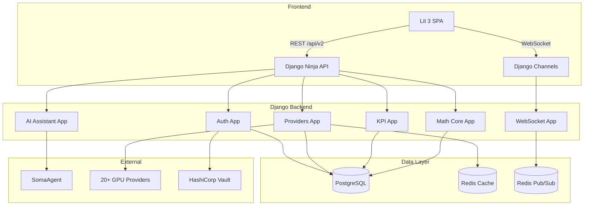

# Software Requirements Specification (SRS)
## GPUBROKER — AI-Powered GPU & Cloud-Instance Marketplace
### Django 5 Architecture Edition

**Document Version:** 2.0.0  
**Date:** 2025-12-28  
**Status:** Django 5 implementation present in repo; migration checklist partially complete  
**Owner:** Agent Zero (agent0)  
**Standards:** ISO/IEC/IEEE 29148:2018, ISO/IEC 25010:2011, ISO/IEC 27001:2022, ISO/IEC 12207:2017

---

## Document Control

| Version | Date | Author | Changes |
|---------|------|--------|---------|
| 1.0.0 | 2025-11-03 | Agent Zero | Initial SRS baseline |
| 2.0.0 | 2025-12-28 | Agent Zero | Django 5 migration edition - reverse-engineered features |

---

## Table of Contents

1. [Introduction](#1-introduction)
2. [Overall Description](#2-overall-description)
3. [Specific Requirements](#3-specific-requirements)
4. [System Architecture](#4-system-architecture)
5. [Data Requirements](#5-data-requirements)
6. [External Interface Requirements](#6-external-interface-requirements)
7. [Quality Attributes](#7-quality-attributes)
8. [Verification & Validation](#8-verification--validation)
9. [Appendices](#9-appendices)

---

## 1. Introduction

### 1.1 Purpose

This Software Requirements Specification defines the complete, testable requirements for GPUBROKER, a SaaS marketplace that aggregates GPU/AI compute from multiple providers. This document serves as the authoritative source for the Django 5 architecture.

### 1.2 Scope

GPUBROKER delivers:
- **Backend Services:** Auth, Provider Aggregator, KPI Analytics, Math Core, AI Assistant, WebSocket Gateway
- **Frontend:** Lit 3 SPA with marketplace, AI chat, admin console
- **Infrastructure:** Kubernetes, Tilt, Minikube (vfkit), GitHub Actions CI/CD
- **Integrations:** 20+ cloud GPU providers, Identity (OIDC), Observability (OTEL/Prometheus/Grafana/Loki)

**Exclusions:** Hardware procurement, provider SLA negotiations, marketing operations.

### 1.3 Definitions, Acronyms, and Abbreviations

| Term | Definition |
|------|------------|
| Adapter | Code module translating provider API to platform schema |
| Offer | Normalized GPU/AI instance SKU with price, region, capacity |
| Tenant | Logical isolation unit (organization) in the platform |
| MCDA | Multi-Criteria Decision Analysis |
| TOPSIS | Technique for Order of Preference by Similarity to Ideal Solution |
| ALS | Alternating Least Squares (collaborative filtering) |
| KPI | Key Performance Indicator |

### 1.4 References

| Document | Version | Description |
|----------|---------|-------------|
| ISO/IEC/IEEE 29148:2018 | 2018 | Systems and software engineering — Requirements engineering |
| ISO/IEC 25010:2011 | 2011 | Systems and software quality models |
| ISO/IEC 27001:2022 | 2022 | Information security management |
| Django Documentation | 5.x | https://docs.djangoproject.com/en/5.0/ |
| Django Ninja | 1.x | https://django-ninja.dev/ |
| Django Channels | 4.x | https://channels.readthedocs.io/ |

### 1.5 Document Overview

- **Section 2:** Product perspective, functions, user classes, constraints
- **Section 3:** Detailed functional and non-functional requirements
- **Section 4:** System architecture with Django 5 patterns
- **Section 5:** Data models and database schema
- **Section 6:** API contracts and external interfaces
- **Section 7:** Quality attributes (performance, security, reliability)
- **Section 8:** Verification and validation approach
- **Section 9:** Appendices (traceability matrix, glossary)

---

## 2. Overall Description

### 2.1 Product Perspective

GPUBROKER is a stand-alone SaaS platform deployed on Kubernetes that:
- Aggregates GPU compute catalogs from 20+ providers via adapters
- Normalizes pricing and availability into a unified marketplace
- Provides AI-assisted recommendations using ensemble algorithms
- Delivers real-time price updates via WebSocket
- Calculates KPIs (cost-per-token, cost-per-GFLOP, efficiency scores)
- Supports multi-tenant operations with RBAC/ABAC

### 2.2 Product Functions (High-Level)

| Function Category | Description |
|-------------------|-------------|
| **Authentication & Authorization** | JWT-based auth, OIDC, MFA, RBAC |
| **Provider Aggregation** | 20+ provider adapters, catalog sync, health monitoring |
| **Marketplace** | Search, filter, sort, pagination, export |
| **AI Recommendations** | Ensemble (TOPSIS + ALS + Content-Based), workload mapping |
| **KPI Analytics** | Cost-per-token, cost-per-GFLOP, efficiency scores |
| **Real-Time Updates** | WebSocket price streaming, heartbeat |
| **Observability** | Metrics, logs, traces, health checks |

### 2.3 User Classes and Characteristics

| User Class | Description | Privileges |
|------------|-------------|------------|
| **End-User** | Data scientists, ML engineers booking compute | Search, book, view KPIs |
| **Admin** | Platform operators managing tenants | Full CRUD, user management |
| **Auditor** | Compliance and security reviewers | Read-only audit logs, reports |
| **API Consumer** | Third-party integrations via SDK | Scoped API access |

### 2.4 Operating Environment

| Component | Specification |
|-----------|---------------|
| **Container Runtime** | containerd, Kubernetes 1.28+ |
| **Database** | PostgreSQL 15 (OLTP), ClickHouse 23 (analytics) |
| **Cache** | Redis 7 cluster |
| **Message Bus** | Kafka 3.5 / Redis Pub/Sub |
| **AI Runtime** | SomaAgent / OpenAI-compatible endpoint |
| **Browsers** | Chrome 120+, Firefox 120+, Edge 120+ |

### 2.5 Design and Implementation Constraints

| Constraint | Rationale |
|------------|-----------|
| **Django 5 + Django Ninja** | API framework standardization |
| **Django Channels** | WebSocket/SSE real-time updates |
| **Django ORM** | Database abstraction (no SQLAlchemy) |
| **Python 3.12** | Backend language standard |
| **TypeScript 5** | Frontend language standard |
| **Open-source stack** | No proprietary dependencies |

### 2.6 Assumptions and Dependencies

- Provider APIs expose catalog/price via REST/GraphQL
- Vault is available for secrets management
- Redis is available for caching and pub/sub
- PostgreSQL is available for persistent storage
- Network connectivity to all provider APIs

---

## 3. Specific Requirements

### 3.1 Functional Requirements — Authentication Service

**FR-AUTH-001: User Registration**
- **Description:** Users can register with email and password
- **Input:** email, password, full_name, organization (optional)
- **Output:** User object with id, email, full_name, is_active, created_at
- **Validation:** Email format, password strength (Argon2 hashing)
- **Django Implementation:** `django.contrib.auth` with custom User model

**FR-AUTH-002: User Login**
- **Description:** Authenticate user and issue JWT tokens
- **Input:** email, password
- **Output:** access_token (15min), refresh_token (7 days), token_type
- **Algorithm:** RS256 JWT signing with private/public key pair
- **Django Implementation:** Django Ninja endpoint with `python-jose`

**FR-AUTH-003: Token Validation**
- **Description:** Validate JWT and extract user context
- **Input:** Authorization header with Bearer token
- **Output:** User object or 401 Unauthorized
- **Django Implementation:** Custom authentication backend

**FR-AUTH-004: Current User Info**
- **Description:** Retrieve authenticated user profile
- **Endpoint:** GET /auth/me
- **Output:** User object with id, email, full_name, organization, is_active, created_at

**FR-AUTH-005: Health Check**
- **Description:** Service health with database connectivity
- **Endpoint:** GET /auth/health
- **Output:** status, database, timestamp

### 3.2 Functional Requirements — Provider Service

**FR-PROV-001: Provider Registry**
- **Description:** Dynamic registration of provider adapters
- **Supported Providers (20):**
  1. AWS SageMaker (`aws_sagemaker`)
  2. Azure ML (`azure_ml`)
  3. Google Vertex AI (`google_vertex_ai`)
  4. RunPod (`runpod`)
  5. Lambda Labs (`lambdalabs`)
  6. Paperspace (`paperspace`)
  7. Groq (`groq`)
  8. Replicate (`replicate`)
  9. DeepInfra (`deepinfra`)
  10. Cerebras (`cerebras`)
  11. Scale AI (`scaleai`)
  12. Alibaba Cloud (`alibaba`)
  13. Tencent Cloud (`tencent`)
  14. Oracle OCI (`oracle_oci`)
  15. NVIDIA DGX (`nvidia_dgx`)
  16. IBM Watson (`ibm_watson`)
  17. Spell (`spell`)
  18. Kaggle (`kaggle`)
  19. Run:AI (`runai`)
  20. Vast.ai (`vastai`)
- **Django Implementation:** Registry pattern with lazy imports

**FR-PROV-002: Adapter Base Contract**
- **Description:** All adapters implement BaseProviderAdapter interface
- **Methods:**
  - `get_offers(auth_token) -> List[ProviderOffer]`
  - `validate_credentials(config) -> bool`
  - `get_health() -> HealthStatus`
- **Properties:** PROVIDER_NAME, BASE_URL

**FR-PROV-003: Normalized Offer Schema**
- **Description:** All provider offers normalized to common schema
- **Schema:**
```python
NormalizedOffer:
    provider: str
    region: str
    gpu_type: str
    price_per_hour: Decimal(8,4)
    currency: str = "USD"
    availability_status: Enum["available", "limited", "unavailable"]
    compliance_tags: List[str]
    gpu_memory_gb: int
    cpu_cores: int
    ram_gb: int
    storage_gb: int
    external_id: str
    tokens_per_second: Optional[int]
    last_updated: datetime
```

**FR-PROV-004: Marketplace Query**
- **Endpoint:** GET /providers
- **Query Parameters:**
  - `gpu` / `gpu_type`: GPU type filter (contains match)
  - `region`: Region filter (exact match)
  - `provider`: Provider name filter
  - `availability`: Status filter (available|limited|unavailable)
  - `compliance_tag`: Tag filter
  - `gpu_memory_min` / `gpu_memory_max`: VRAM range
  - `price_min` / `max_price`: Price range
  - `page` / `per_page`: Pagination (default 1, 20)
- **Response:** `{ total: int, items: List[ProviderItem], warnings: Optional[List[str]] }`
- **Performance:** ≤200ms p95 with Redis cache (60s TTL)

**FR-PROV-005: Integration Configuration**
- **Endpoint:** POST /config/integrations
- **Description:** Save API key and settings for a provider
- **Input:** provider, api_key, api_url
- **Validation:** Credentials validated against provider before saving
- **Storage:** user_preferences table with JSON value

**FR-PROV-006: Integration Status**
- **Endpoint:** GET /config/integrations
- **Description:** List configured integrations with health status
- **Output:** List of IntegrationStatus (provider, status, message, last_checked)

**FR-PROV-007: Rate Limiting**
- **Description:** Per-plan rate limiting (X-Plan header)
- **Limits:**
  - Free: 10 req/min
  - Pro: 100 req/min
  - Enterprise: 1000 req/min
- **Response:** 429 Too Many Requests with Retry-After header

**FR-PROV-008: Circuit Breaker**
- **Description:** Async circuit breaker per provider adapter
- **States:** Closed → Open → Half-Open
- **Thresholds:** 5 failures → open, 30s timeout → half-open

**FR-PROV-009: Vault Secret Resolution**
- **Description:** API keys resolved from Vault with env fallback
- **Path:** `secret/data/gpubroker/{provider}/api_key`
- **Fallback:** `{PROVIDER}_API_KEY` environment variable

### 3.3 Functional Requirements — KPI Service

**FR-KPI-001: KPI Overview Dashboard**
- **Endpoint:** GET /kpi/overview
- **Description:** Aggregate KPI cards for dashboard
- **Output:**
```python
KPIOverviewResponse:
    cost_per_token: Optional[float]
    uptime_pct: Optional[float]
    avg_latency_ms: Optional[float]
    active_providers: int
```

**FR-KPI-002: GPU-Specific KPIs**
- **Endpoint:** GET /kpi/kpis/gpu/{gpu_type}
- **Description:** Comprehensive KPIs for a specific GPU type
- **Output:**
```python
GPUMetrics:
    gpu_type: str
    provider: str
    avg_price_per_hour: float
    cost_per_token: Optional[float]
    cost_per_gflop: Optional[float]
    availability_score: Optional[float]
    reliability_score: Optional[float]
    performance_score: Optional[float]
    region: str
    last_updated: datetime
```

**FR-KPI-003: Provider KPIs**
- **Endpoint:** GET /kpi/kpis/provider/{provider_name}
- **Description:** Comprehensive KPIs for a specific provider
- **Output:**
```python
ProviderKPI:
    provider: str
    total_offers: int
    avg_price_per_hour: float
    price_volatility: float  # Standard deviation
    uptime_percentage: float
    response_time_ms: float
    customer_satisfaction: Optional[float]
    cost_efficiency_score: float
    reliability_index: float
```

**FR-KPI-004: Market Insights**
- **Endpoint:** GET /kpi/insights/market
- **Description:** Comprehensive market insights and trends
- **Output:**
```python
MarketInsights:
    total_providers: int
    total_offers: int
    cheapest_gpu_offer: Optional[Dict]
    most_expensive_gpu_offer: Optional[Dict]
    avg_market_price: float
    price_trend_7d: float  # Percentage change
    demand_hotspots: List[str]
    supply_constraints: List[str]
    generated_at: datetime
```

**FR-KPI-005: Workload Cost Optimization**
- **Endpoint:** POST /kpi/optimize/workload
- **Description:** Cost optimization recommendations for workloads
- **Input:** workload_data (type, requirements)
- **Output:**
```python
CostOptimization:
    workload_type: str
    recommended_provider: str
    recommended_gpu: str
    estimated_cost_savings: float
    savings_percentage: float
    reasoning: List[str]
    risk_factors: List[str]
```

### 3.4 Functional Requirements — Math Core Service

**FR-MATH-001: Cost Per Token Calculation**
- **Endpoint:** POST /math/cost-per-token
- **Description:** Calculate cost per token for LLM inference
- **Formula:** `cost_per_token = price_per_hour / (tokens_per_second * 3600)`
- **Input:** price_per_hour, gpu_type, model_size (7b|13b|70b)
- **Output:** cost_per_token, cost_per_million_tokens, tokens_per_second, confidence
- **Precision:** IEEE 754 double precision, 4 decimal rounding

**FR-MATH-002: Cost Per GFLOP Calculation**
- **Endpoint:** POST /math/cost-per-gflop
- **Description:** Calculate cost per GFLOP for compute workloads
- **Formula:** `cost_per_gflop = price_per_hour / (tflops * 1000)`
- **Input:** price_per_hour, gpu_type
- **Output:** cost_per_gflop, cost_per_tflop_hour, gpu_tflops, confidence

**FR-MATH-003: Efficiency Score Calculation**
- **Endpoint:** POST /math/efficiency-score
- **Description:** Overall efficiency combining price, performance, reliability
- **Formula:**
```
efficiency_score = (performance_score * 0.4) + (price_score * 0.35) + 
                   (availability_score * 0.15) + (reliability_score * 0.1)
```
- **Input:** price_per_hour, gpu_type, availability_score, reliability_score
- **Output:** efficiency_score, breakdown

**FR-MATH-004: TOPSIS Algorithm**
- **Endpoint:** POST /math/topsis
- **Description:** Multi-criteria decision analysis for ranking alternatives
- **Algorithm Steps:**
  1. Normalize decision matrix (L2 norm)
  2. Calculate weighted normalized matrix
  3. Determine ideal (A+) and anti-ideal (A-) solutions
  4. Calculate Euclidean separation measures
  5. Calculate relative closeness to ideal
  6. Rank by closeness score
- **Input:** decision_matrix, weights (sum=1), criteria_types (benefit|cost)
- **Output:** rankings, scores, ideal_solution, anti_ideal_solution

**FR-MATH-005: Content Similarity**
- **Endpoint:** POST /math/content-similarity
- **Description:** Cosine similarity between query and candidate vectors
- **Input:** query_vector, candidate_vectors, top_k
- **Output:** matches (indices), scores

**FR-MATH-006: Ensemble Recommendations**
- **Endpoint:** POST /math/ensemble-recommend
- **Description:** Weighted ensemble of multiple algorithms
- **Weights:** TOPSIS (0.4) + Collaborative (0.3) + Content-Based (0.3)
- **Cold-Start:** Popularity-based fallback when no user history
- **Input:** user_id, workload_profile, candidate_offers, top_k
- **Output:** recommendations, algorithm_contributions, confidence

**FR-MATH-007: Workload Estimation**
- **Endpoint:** POST /math/estimate-workload
- **Description:** Estimate GPU requirements for workload
- **Input:** workload_type, quantity, duration_hours, quality, model_name
- **Output:** min_vram_gb, recommended_vram_gb, recommended_gpu_tiers, estimated_cost_range

**FR-MATH-008: GPU Benchmarks Repository**
- **Endpoint:** GET /math/benchmarks
- **Description:** List all verified GPU benchmarks
- **Data Sources:** NVIDIA specs, MLPerf, Lambda Labs
- **Supported GPUs:** H100, A100, V100, RTX 4090/4080/3090/3080, T4, L40S, L4, A10, A6000
- **Metrics:** tflops_fp32, tflops_fp16, tflops_int8, memory_bandwidth, vram_gb, tokens_per_second

**FR-MATH-009: Price Analytics**
- **Endpoint:** POST /math/analyze-prices
- **Description:** Comprehensive price time series analysis
- **Output:** trend, statistics, anomalies, volatility metrics

**FR-MATH-010: Price Forecasting**
- **Endpoint:** POST /math/forecast-price
- **Description:** Forecast future prices using time-series models
- **Methods:** ARIMA, exponential smoothing, linear, auto
- **Input:** prices, horizon_hours, method
- **Output:** forecast with confidence intervals

**FR-MATH-011: Anomaly Detection**
- **Endpoint:** POST /math/detect-anomaly
- **Description:** Detect price anomalies using statistical methods
- **Methods:** Z-score, IQR, Isolation Forest
- **Input:** current_price, historical_prices, threshold_z
- **Output:** is_anomaly, z_score, method_results

**FR-MATH-012: MCDA Ranking Engine**
- **Endpoint:** POST /math/mcda-rank
- **Description:** Rank using multiple MCDA methods
- **Methods:** WSM, WPM, AHP, ELECTRE, PROMETHEE
- **Output:** Individual rankings + Borda count ensemble

**FR-MATH-013: Sensitivity Analysis**
- **Endpoint:** POST /math/sensitivity-analysis
- **Description:** Test ranking stability under weight perturbation
- **Input:** alternatives, weights, criteria_types, method, perturbation
- **Output:** stability metrics, critical criteria

### 3.5 Functional Requirements — AI Assistant Service

**FR-AI-001: Chat Interface**
- **Endpoint:** POST /ai/chat
- **Description:** Natural language AI assistant for GPU recommendations
- **Input:**
```python
ChatRequest:
    user_id: Optional[str]
    message: str
    context: Dict[str, Any]  # filters, workload_profile
    history: List[Dict[str, str]]  # [{role, content}]
```
- **Output:**
```python
ChatResponse:
    reply: str
    sources: Optional[List[str]]
    elapsed_ms: float
    recommendations: Optional[List[Dict]]  # From Math Core ensemble
    session_history: Optional[List[Dict]]
```
- **Integration:** SomaAgent backend, Math Core ensemble recommendations
- **History Limit:** MAX_HISTORY_TURNS (default 10)

**FR-AI-002: Session History**
- **Endpoint:** GET /ai/sessions/{session_id}/history
- **Description:** Retrieve conversation history for a session
- **Input:** session_id, limit (default 50)
- **Output:** List of conversation turns

**FR-AI-003: Tool Listing**
- **Endpoint:** GET /ai/tools
- **Description:** List available AI agent tools
- **Output:** Tool definitions from SomaAgent

**FR-AI-004: Agent Health**
- **Endpoint:** GET /ai/health
- **Description:** SomaAgent backend health status
- **Output:** Health status from SomaAgent

**FR-AI-005: Workload Parsing**
- **Endpoint:** POST /ai/parse-workload
- **Description:** Parse natural language workload description
- **Input:** text (natural language)
- **Output:**
```python
ParsedWorkload:
    workload_type: str  # llm_inference, image_generation
    quantity: Optional[int]
    duration: Optional[str]
    region: Optional[str]
    quality: Optional[str]
```

### 3.6 Functional Requirements — WebSocket Gateway

**FR-WS-001: Price Update Stream**
- **Endpoint:** WebSocket /ws
- **Description:** Real-time price updates via WebSocket
- **Protocol:** Redis Pub/Sub → WebSocket fan-out
- **Channel:** `price_updates` (configurable via PRICE_UPDATES_CHANNEL)
- **Message Format:**
```json
{
    "offer_id": "string",
    "gpu_type": "string",
    "region": "string",
    "new_price": 0.00,
    "ts": "ISO8601"
}
```

**FR-WS-002: Heartbeat**
- **Description:** Keep-alive ping every 30 seconds
- **Message:** `{"type": "heartbeat"}`
- **Timeout:** HEARTBEAT_SECONDS (default 30)

**FR-WS-003: Connection Management**
- **Description:** Track active WebSocket connections
- **Operations:** connect, disconnect, broadcast
- **Dead Connection Cleanup:** Automatic on send failure

**FR-WS-004: Redis Pub/Sub Listener**
- **Description:** Background task subscribing to Redis channel
- **Reconnection:** Automatic with exponential backoff
- **Django Implementation:** Django Channels with Redis channel layer

### 3.7 Non-Functional Requirements — Performance

| ID | Requirement | Target | Measurement |
|----|-------------|--------|-------------|
| NFR-PERF-001 | Marketplace query latency (cached) | ≤120ms p95 | APM |
| NFR-PERF-002 | Marketplace query latency (uncached) | ≤200ms p95 | APM |
| NFR-PERF-003 | AI chat response time | ≤2s end-to-end | APM |
| NFR-PERF-004 | AI chat first token (streaming) | ≤800ms | APM |
| NFR-PERF-005 | WebSocket price propagation | ≤2s ingest-to-client | APM |
| NFR-PERF-006 | Provider sync throughput | ≥5,000 records/min | Metrics |
| NFR-PERF-007 | Concurrent users | 10,000 | Load test |
| NFR-PERF-008 | Error rate under load | ≤5% | Metrics |
| NFR-PERF-009 | Cache hit rate | ≥70% | Metrics |

### 3.8 Non-Functional Requirements — Security

| ID | Requirement | Implementation |
|----|-------------|----------------|
| NFR-SEC-001 | TLS 1.3 for external traffic | Ingress controller |
| NFR-SEC-002 | mTLS for internal services | Service mesh |
| NFR-SEC-003 | Secrets in Vault only | No plaintext in code/images |
| NFR-SEC-004 | OWASP Top 10 mitigations | ZAP scans per build |
| NFR-SEC-005 | Immutable audit log | Hash chain (SHA-256) |
| NFR-SEC-006 | JWT RS256 signing | Private/public key pair |
| NFR-SEC-007 | Password hashing | Argon2 |
| NFR-SEC-008 | Rate limiting | Per-tenant, per-plan |
| NFR-SEC-009 | Input validation | Pydantic/Django validators |
| NFR-SEC-010 | CORS configuration | Per-tenant origins |

### 3.9 Non-Functional Requirements — Reliability

| ID | Requirement | Target |
|----|-------------|--------|
| NFR-REL-001 | Service uptime | 99.9% (excluding maintenance) |
| NFR-REL-002 | Zero-downtime deployments | Rolling updates |
| NFR-REL-003 | Automated rollback | On failed health checks |
| NFR-REL-004 | RPO (Recovery Point Objective) | ≤15 minutes |
| NFR-REL-005 | RTO (Recovery Time Objective) | ≤60 minutes |
| NFR-REL-006 | Circuit breaker per adapter | 5 failures → open |
| NFR-REL-007 | Graceful degradation | Partial results on adapter failure |

### 3.10 Non-Functional Requirements — Maintainability

| ID | Requirement | Target |
|----|-------------|--------|
| NFR-MAINT-001 | Code coverage | ≥80% |
| NFR-MAINT-002 | Lint clean | Ruff, Black, isort |
| NFR-MAINT-003 | Type hints | 100% coverage |
| NFR-MAINT-004 | API versioning | /api/v2/ for Django |
| NFR-MAINT-005 | Documentation | Auto-generated OpenAPI |
| NFR-MAINT-006 | Semantic versioning | MAJOR.MINOR.PATCH |

---

## 4. System Architecture

### 4.1 Django 5 Application Structure

```
gpubroker/
├── manage.py
├── gpubroker/                    # Project settings
│   ├── settings/
│   │   ├── base.py
│   │   ├── development.py
│   │   └── production.py
│   ├── urls.py
│   ├── asgi.py                   # Channels ASGI
│   └── wsgi.py
├── apps/
│   ├── auth/                     # Authentication app
│   │   ├── models.py             # User, Session, APIKey
│   │   ├── api.py                # Django Ninja router
│   │   ├── services.py           # Business logic
│   │   └── backends.py           # JWT authentication
│   ├── providers/                # Provider aggregation app
│   │   ├── models.py             # Provider, GPUOffer, PriceHistory
│   │   ├── api.py                # Django Ninja router
│   │   ├── adapters/             # Provider adapters
│   │   │   ├── base.py
│   │   │   ├── runpod.py
│   │   │   ├── vastai.py
│   │   │   └── ... (20 adapters)
│   │   ├── registry.py           # Adapter registry
│   │   └── services.py           # Sync, cache, circuit breaker
│   ├── kpi/                      # KPI analytics app
│   │   ├── models.py             # KPICalculation, HealthCheck
│   │   ├── api.py                # Django Ninja router
│   │   └── services.py           # KPI calculations
│   ├── math_core/                # Math algorithms app
│   │   ├── api.py                # Django Ninja router
│   │   ├── algorithms/
│   │   │   ├── topsis.py
│   │   │   ├── collaborative.py
│   │   │   ├── content_based.py
│   │   │   ├── ensemble.py
│   │   │   ├── workload_mapper.py
│   │   │   ├── price_analytics.py
│   │   │   └── ranking_engine.py
│   │   ├── benchmarks.py         # GPU benchmark repository
│   │   └── kpi_calculator.py     # Cost calculations
│   ├── ai_assistant/             # AI assistant app
│   │   ├── api.py                # Django Ninja router
│   │   ├── client.py             # SomaAgent client
│   │   └── services.py           # Chat, parsing
│   ├── websocket/                # WebSocket app
│   │   ├── consumers.py          # Django Channels consumers
│   │   ├── routing.py            # WebSocket routing
│   │   └── services.py           # Connection manager
│   └── common/                   # Shared utilities
│       ├── middleware.py         # Rate limiting, logging
│       ├── exceptions.py         # Custom exceptions
│       ├── vault.py              # Vault client
│       └── messages.py           # I18N messages
└── tests/
    ├── unit/
    ├── integration/
    └── e2e/
```

### 4.2 Component Diagram



### 4.3 API Routing Structure

```python
# gpubroker/urls.py
from django.urls import path
from ninja import NinjaAPI

api = NinjaAPI(
    title="GPUBROKER API",
    version="2.0.0",
    urls_namespace="api_v2"
)

# Mount app routers
api.add_router("/auth/", "apps.auth.api.router")
api.add_router("/providers/", "apps.providers.api.router")
api.add_router("/kpi/", "apps.kpi.api.router")
api.add_router("/math/", "apps.math_core.api.router")
api.add_router("/ai/", "apps.ai_assistant.api.router")

urlpatterns = [
    path("api/v2/", api.urls),
]
```

### 4.4 Django Channels Configuration

```python
# gpubroker/asgi.py
from channels.routing import ProtocolTypeRouter, URLRouter
from channels.auth import AuthMiddlewareStack
from apps.websocket.routing import websocket_urlpatterns

application = ProtocolTypeRouter({
    "http": get_asgi_application(),
    "websocket": AuthMiddlewareStack(
        URLRouter(websocket_urlpatterns)
    ),
})

# apps/websocket/routing.py
from django.urls import re_path
from . import consumers

websocket_urlpatterns = [
    re_path(r"ws/$", consumers.PriceUpdateConsumer.as_asgi()),
]
```

### 4.5 Data Flow Diagrams

**Marketplace Query Flow:**
```
Client → Django Ninja → Rate Limiter → Cache Check
    ↓ (cache miss)
Provider Service → DB Query → Filter/Sort → Cache Write → Response
```

**Provider Sync Flow:**
```
Scheduler → Adapter Registry → Circuit Breaker → Provider API
    ↓
Normalize → Validate → Upsert DB → Price History → Cache Invalidate
    ↓
Redis Pub/Sub → WebSocket Broadcast
```

**AI Recommendation Flow:**
```
Client → AI Assistant → SomaAgent → LLM
    ↓
Provider Service → Candidate Offers
    ↓
Math Core → Ensemble (TOPSIS + ALS + Content) → Ranked Results
    ↓
Response with recommendations
```

---

## 5. Data Requirements

### 5.1 Database Schema (Django ORM Models)

**Users & Authentication:**

```python
# apps/auth/models.py
from django.contrib.auth.models import AbstractBaseUser, PermissionsMixin
from django.db import models
import uuid

class User(AbstractBaseUser, PermissionsMixin):
    id = models.UUIDField(primary_key=True, default=uuid.uuid4)
    email = models.EmailField(unique=True)
    full_name = models.CharField(max_length=255)
    organization = models.CharField(max_length=255, blank=True, null=True)
    is_active = models.BooleanField(default=True)
    is_verified = models.BooleanField(default=False)
    created_at = models.DateTimeField(auto_now_add=True)
    updated_at = models.DateTimeField(auto_now=True)
    last_login = models.DateTimeField(null=True, blank=True)
    
    USERNAME_FIELD = 'email'
    REQUIRED_FIELDS = ['full_name']

class UserSession(models.Model):
    jti = models.UUIDField(primary_key=True, default=uuid.uuid4)
    user = models.ForeignKey(User, on_delete=models.CASCADE)
    refresh_token_hash = models.CharField(max_length=255)
    expires_at = models.DateTimeField()
    created_at = models.DateTimeField(auto_now_add=True)
    revoked_at = models.DateTimeField(null=True, blank=True)
    user_agent = models.TextField(blank=True)
    ip_address = models.GenericIPAddressField(null=True)

class APIKey(models.Model):
    id = models.UUIDField(primary_key=True, default=uuid.uuid4)
    user = models.ForeignKey(User, on_delete=models.CASCADE)
    key_hash = models.CharField(max_length=255)
    name = models.CharField(max_length=100)
    scopes = models.JSONField(default=list)
    last_used_at = models.DateTimeField(null=True)
    expires_at = models.DateTimeField(null=True)
    created_at = models.DateTimeField(auto_now_add=True)
    revoked_at = models.DateTimeField(null=True)
```

**Providers & Marketplace:**

```python
# apps/providers/models.py
from django.db import models
import uuid

class Provider(models.Model):
    class Status(models.TextChoices):
        ACTIVE = 'active'
        MAINTENANCE = 'maintenance'
        DEPRECATED = 'deprecated'
    
    id = models.UUIDField(primary_key=True, default=uuid.uuid4)
    name = models.CharField(max_length=100, unique=True)
    display_name = models.CharField(max_length=100)
    website_url = models.URLField(max_length=500, blank=True)
    api_base_url = models.URLField(max_length=500)
    documentation_url = models.URLField(max_length=500, blank=True)
    status = models.CharField(max_length=20, choices=Status.choices, default=Status.ACTIVE)
    supported_regions = models.JSONField(default=list)
    compliance_tags = models.JSONField(default=list)
    reliability_score = models.DecimalField(max_digits=3, decimal_places=2, default=0.5)
    created_at = models.DateTimeField(auto_now_add=True)
    updated_at = models.DateTimeField(auto_now=True)
    
    class Meta:
        indexes = [
            models.Index(fields=['status']),
            models.Index(fields=['name']),
        ]

class GPUOffer(models.Model):
    class AvailabilityStatus(models.TextChoices):
        AVAILABLE = 'available'
        LIMITED = 'limited'
        UNAVAILABLE = 'unavailable'
    
    id = models.UUIDField(primary_key=True, default=uuid.uuid4)
    provider = models.ForeignKey(Provider, on_delete=models.CASCADE, related_name='offers')
    external_id = models.CharField(max_length=255)
    gpu_type = models.CharField(max_length=100)
    gpu_memory_gb = models.IntegerField()
    cpu_cores = models.IntegerField()
    ram_gb = models.IntegerField()
    storage_gb = models.IntegerField()
    storage_type = models.CharField(max_length=20, default='SSD')
    price_per_hour = models.DecimalField(max_digits=8, decimal_places=4)
    currency = models.CharField(max_length=3, default='USD')
    region = models.CharField(max_length=50)
    availability_zone = models.CharField(max_length=100, blank=True)
    availability_status = models.CharField(
        max_length=20, 
        choices=AvailabilityStatus.choices, 
        default=AvailabilityStatus.AVAILABLE
    )
    min_rental_time = models.IntegerField(default=1)  # minutes
    max_rental_time = models.IntegerField(null=True)
    spot_pricing = models.BooleanField(default=False)
    preemptible = models.BooleanField(default=False)
    sla_uptime = models.DecimalField(max_digits=5, decimal_places=2, null=True)
    network_speed_gbps = models.DecimalField(max_digits=6, decimal_places=2, null=True)
    compliance_tags = models.JSONField(default=list)
    created_at = models.DateTimeField(auto_now_add=True)
    updated_at = models.DateTimeField(auto_now=True)
    last_seen_at = models.DateTimeField(auto_now=True)
    
    class Meta:
        unique_together = ['provider', 'external_id']
        indexes = [
            models.Index(fields=['gpu_type']),
            models.Index(fields=['region']),
            models.Index(fields=['price_per_hour']),
            models.Index(fields=['availability_status']),
            models.Index(fields=['gpu_type', 'region', 'availability_status', 'price_per_hour']),
        ]

class PriceHistory(models.Model):
    id = models.UUIDField(primary_key=True, default=uuid.uuid4)
    offer = models.ForeignKey(GPUOffer, on_delete=models.CASCADE, related_name='price_history')
    price_per_hour = models.DecimalField(max_digits=8, decimal_places=4)
    availability_status = models.CharField(max_length=20)
    recorded_at = models.DateTimeField(auto_now_add=True)
    
    class Meta:
        indexes = [
            models.Index(fields=['offer', 'recorded_at']),
        ]
```

**KPI & Analytics:**

```python
# apps/kpi/models.py
from django.db import models
import uuid

class KPICalculation(models.Model):
    id = models.UUIDField(primary_key=True, default=uuid.uuid4)
    offer = models.ForeignKey('providers.GPUOffer', on_delete=models.CASCADE)
    calculation_type = models.CharField(max_length=50)  # cost_per_token, cost_per_gflop, efficiency_score
    value = models.DecimalField(max_digits=12, decimal_places=6)
    metadata = models.JSONField(default=dict)
    calculated_at = models.DateTimeField(auto_now_add=True)
    
    class Meta:
        unique_together = ['offer', 'calculation_type', 'calculated_at__date']
        indexes = [
            models.Index(fields=['calculation_type']),
            models.Index(fields=['calculated_at']),
        ]

class ProviderHealthCheck(models.Model):
    class Status(models.TextChoices):
        HEALTHY = 'healthy'
        DEGRADED = 'degraded'
        DOWN = 'down'
        ERROR = 'error'
    
    id = models.UUIDField(primary_key=True, default=uuid.uuid4)
    provider = models.ForeignKey('providers.Provider', on_delete=models.CASCADE)
    status = models.CharField(max_length=20, choices=Status.choices)
    response_time_ms = models.IntegerField()
    error_message = models.TextField(blank=True)
    checked_at = models.DateTimeField(auto_now_add=True)
    
    class Meta:
        indexes = [
            models.Index(fields=['provider', 'checked_at']),
        ]
```

**Audit & Compliance:**

```python
# apps/common/models.py
from django.db import models
import uuid
import hashlib

class AuditLog(models.Model):
    id = models.UUIDField(primary_key=True, default=uuid.uuid4)
    event_type = models.CharField(max_length=50)
    user = models.ForeignKey('auth.User', on_delete=models.SET_NULL, null=True)
    resource_type = models.CharField(max_length=50, blank=True)
    resource_id = models.UUIDField(null=True)
    event_data = models.JSONField(default=dict)
    ip_address = models.GenericIPAddressField(null=True)
    user_agent = models.TextField(blank=True)
    created_at = models.DateTimeField(auto_now_add=True)
    previous_hash = models.CharField(max_length=64, blank=True)
    current_hash = models.CharField(max_length=64, blank=True)
    
    def save(self, *args, **kwargs):
        # Maintain hash chain
        if not self.previous_hash:
            last = AuditLog.objects.order_by('-created_at').first()
            self.previous_hash = last.current_hash if last else ''
        
        # Calculate current hash
        data = f"{self.previous_hash}{self.id}{self.event_type}{self.user_id or ''}{self.event_data}{self.created_at}"
        self.current_hash = hashlib.sha256(data.encode()).hexdigest()
        super().save(*args, **kwargs)
    
    class Meta:
        indexes = [
            models.Index(fields=['event_type']),
            models.Index(fields=['user']),
            models.Index(fields=['created_at']),
            models.Index(fields=['resource_type', 'resource_id']),
        ]
```

### 5.2 Data Classification

| Category | Data Elements | Sensitivity | Retention |
|----------|---------------|-------------|-----------|
| **PII** | email, full_name, organization, IP, user_agent | High | Per GDPR |
| **Sensitive** | password_hash, api_key_hash, JWT secrets | Critical | Encrypted |
| **Business** | offers, prices, KPIs | Medium | 2 years |
| **Audit** | audit_log | High | 2+ years |
| **Public** | provider catalogs (non-PII) | Low | 30 days |

### 5.3 Data Retention Policy

| Data Type | Hot Storage | Archive | Deletion |
|-----------|-------------|---------|----------|
| Audit logs | 90 days | 2 years | After 2 years |
| Price history | 30 days | 1 year | After 1 year |
| User sessions | 7 days | N/A | On expiry |
| GPU offers | Current | N/A | On provider removal |
| KPI calculations | 30 days | 1 year | After 1 year |

---

## 6. External Interface Requirements

### 6.1 API Contracts — Authentication

**POST /api/v2/auth/register**
```yaml
Request:
  Content-Type: application/json
  Body:
    email: string (required, email format)
    password: string (required, min 8 chars)
    full_name: string (required)
    organization: string (optional)

Response 201:
  id: uuid
  email: string
  full_name: string
  organization: string | null
  is_active: boolean
  created_at: datetime

Response 400:
  detail: "Email already registered" | "Invalid email format"
```

**POST /api/v2/auth/login**
```yaml
Request:
  Content-Type: application/json
  Body:
    email: string (required)
    password: string (required)

Response 200:
  access_token: string (JWT, 15min expiry)
  refresh_token: string (JWT, 7 day expiry)
  token_type: "bearer"

Response 401:
  detail: "Invalid credentials" | "Account disabled"
```

**GET /api/v2/auth/me**
```yaml
Request:
  Authorization: Bearer <access_token>

Response 200:
  id: uuid
  email: string
  full_name: string
  organization: string | null
  is_active: boolean
  created_at: datetime

Response 401:
  detail: "Invalid token" | "User not found"
```

### 6.2 API Contracts — Providers

**GET /api/v2/providers**
```yaml
Request:
  Query Parameters:
    gpu: string (optional, contains match)
    gpu_type: string (optional, alias for gpu)
    region: string (optional, exact match)
    provider: string (optional, exact match)
    availability: string (optional, available|limited|unavailable)
    compliance_tag: string (optional)
    gpu_memory_min: integer (optional, >= 0)
    gpu_memory_max: integer (optional, >= 0)
    price_min: float (optional, >= 0)
    max_price: float (optional)
    page: integer (default 1, >= 1)
    per_page: integer (default 20, 1-100)
  Headers:
    X-Plan: string (optional, free|pro|enterprise)

Response 200:
  total: integer
  items:
    - id: string
      provider: string
      name: string
      gpu: string
      memory_gb: integer
      price_per_hour: float
      currency: string
      availability: string
      region: string
      tags: string[]
      last_updated: datetime
  warnings: string[] | null

Response 429:
  detail: "Rate limit exceeded"
  headers:
    Retry-After: integer (seconds)
```

**POST /api/v2/config/integrations**
```yaml
Request:
  Content-Type: application/json
  Body:
    provider: string (required)
    api_key: string (optional)
    api_url: string (optional)

Response 200:
  status: "saved"
  provider: string

Response 400:
  detail: "Invalid provider credentials"
```

### 6.3 API Contracts — KPI

**GET /api/v2/kpi/overview**
```yaml
Response 200:
  cost_per_token: float | null
  uptime_pct: float | null
  avg_latency_ms: float | null
  active_providers: integer
```

**GET /api/v2/kpi/kpis/gpu/{gpu_type}**
```yaml
Response 200:
  gpu_type: string
  provider: string
  avg_price_per_hour: float
  cost_per_token: float | null
  cost_per_gflop: float | null
  availability_score: float | null
  reliability_score: float | null
  performance_score: float | null
  region: string
  last_updated: datetime
```

### 6.4 API Contracts — Math Core

**POST /api/v2/math/cost-per-token**
```yaml
Request:
  Content-Type: application/json
  Body:
    price_per_hour: float (required, > 0)
    gpu_type: string (required)
    model_size: string (optional, default "7b", enum: 7b|13b|70b)

Response 200:
  cost_per_token: float
  cost_per_million_tokens: float
  tokens_per_second: integer
  confidence: float (0-1)
  calculation_details:
    price_per_hour: float
    gpu_type: string
    model_size: string
    tokens_per_hour: integer
    formula: string
```

**POST /api/v2/math/topsis**
```yaml
Request:
  Content-Type: application/json
  Body:
    decision_matrix: float[][] (required, alternatives x criteria)
    weights: float[] (required, must sum to 1.0)
    criteria_types: string[] (required, benefit|cost for each)

Response 200:
  rankings: integer[] (0-indexed, best first)
  scores: float[] (closeness to ideal, 0-1)
  ideal_solution: float[]
  anti_ideal_solution: float[]

Response 400:
  detail: "Weights must sum to 1.0" | "Invalid criteria type"
```

**POST /api/v2/math/ensemble-recommend**
```yaml
Request:
  Content-Type: application/json
  Body:
    user_id: string | null
    workload_profile:
      budget_per_hour: float (optional)
      workload_type: string (optional)
      region_preference: string (optional)
    candidate_offers: object[]
    top_k: integer (default 5, 1-20)

Response 200:
  recommendations:
    - ensemble_score: float
      score_breakdown:
        topsis: float
        collaborative: float
        content_based: float
      # ... offer fields
  algorithm_contributions:
    topsis: float
    collaborative: float
    content_based: float
  confidence: float (0-1)
```

### 6.5 API Contracts — AI Assistant

**POST /api/v2/ai/chat**
```yaml
Request:
  Content-Type: application/json
  Body:
    user_id: string | null
    message: string (required, min 1 char)
    context:
      filters: object (optional)
      workload_profile: object (optional)
    history: object[] (optional, [{role, content}])

Response 200:
  reply: string
  sources: string[] | null
  elapsed_ms: float
  recommendations: object[] | null
  session_history: object[] | null

Response 502:
  detail: "AI agent call failed"
```

### 6.6 WebSocket Protocol

**Connection:** `wss://api.gpubroker.com/ws`

**Server → Client Messages:**

```json
// Price Update
{
  "type": "price_update",
  "offer_id": "runpod:a100-80gb:us-east",
  "gpu_type": "A100",
  "region": "us-east",
  "new_price": 2.49,
  "ts": "2025-12-28T10:30:00Z"
}

// Heartbeat
{
  "type": "heartbeat"
}
```

**Client → Server Messages:**
```json
// Keep-alive (optional)
{
  "type": "ping"
}
```

### 6.7 Error Response Format

All API errors follow consistent format:

```json
{
  "detail": "Human-readable error message",
  "code": "ERROR_CODE",
  "trace_id": "uuid",
  "errors": [
    {
      "field": "email",
      "message": "Invalid email format"
    }
  ]
}
```

| HTTP Status | Usage |
|-------------|-------|
| 400 | Validation error, bad request |
| 401 | Authentication required or failed |
| 403 | Authorization denied |
| 404 | Resource not found |
| 409 | Conflict (duplicate, state violation) |
| 429 | Rate limit exceeded |
| 500 | Internal server error |
| 502 | Upstream service error |
| 503 | Service unavailable |

### 6.8 Redis Pub/Sub Channels

| Channel | Publisher | Subscribers | Message Format |
|---------|-----------|-------------|----------------|
| `price_updates` | Provider sync | WebSocket Gateway | JSON price update |
| `health_updates` | Health checker | KPI Service | JSON health status |
| `audit_events` | All services | Audit sink | JSON audit entry |

---

## 7. Quality Attributes

### 7.1 Performance Requirements

| Metric | Target | Measurement Method |
|--------|--------|-------------------|
| API response time (p50) | ≤50ms | APM (OTEL) |
| API response time (p95) | ≤200ms | APM (OTEL) |
| API response time (p99) | ≤500ms | APM (OTEL) |
| WebSocket latency | ≤2s end-to-end | Custom metrics |
| Database query time | ≤50ms | Django Debug Toolbar |
| Cache hit rate | ≥70% | Redis metrics |
| Throughput | 1000 req/s per instance | Load testing (k6) |

### 7.2 Scalability Requirements

| Dimension | Approach |
|-----------|----------|
| Horizontal scaling | Kubernetes HPA on CPU/memory |
| Database scaling | Read replicas, connection pooling |
| Cache scaling | Redis Cluster |
| WebSocket scaling | Redis Pub/Sub channel layer |
| Provider sync | Distributed task queue (Celery) |

### 7.3 Security Requirements

| Requirement | Implementation |
|-------------|----------------|
| Authentication | JWT RS256, 15min access token |
| Authorization | Django permissions + OPA policies |
| Encryption at rest | PostgreSQL TDE, Redis encryption |
| Encryption in transit | TLS 1.3, mTLS for internal |
| Secrets management | HashiCorp Vault |
| Input validation | Pydantic + Django validators |
| SQL injection | Django ORM parameterized queries |
| XSS prevention | Django template escaping |
| CSRF protection | Django CSRF middleware |
| Rate limiting | Per-tenant, per-plan limits |

### 7.4 Reliability Requirements

| Requirement | Target | Implementation |
|-------------|--------|----------------|
| Availability | 99.9% | Multi-AZ deployment |
| MTTR | ≤15 minutes | Automated rollback |
| MTBF | ≥720 hours | Chaos engineering |
| Data durability | 99.999999999% | PostgreSQL WAL + backups |
| Failover time | ≤30 seconds | Kubernetes probes |

### 7.5 Observability Requirements

**Metrics (Prometheus):**
- Request latency histograms
- Error rates by endpoint
- Cache hit/miss rates
- Provider sync throughput
- WebSocket connection count
- Database connection pool

**Logs (Loki):**
- Structured JSON format
- Correlation IDs (trace_id, span_id)
- PII redaction
- Log levels: DEBUG, INFO, WARNING, ERROR

**Traces (Tempo):**
- W3C Trace Context propagation
- Span attributes for debugging
- Service dependency mapping

**Dashboards (Grafana):**
- Service health overview
- API performance
- Provider status
- KPI trends
- Security events

### 7.6 Compliance Requirements

| Standard | Requirements |
|----------|--------------|
| **GDPR** | Data minimization, DSR support, consent management |
| **SOC 2 Type II** | Audit logging, access controls, encryption |
| **ISO 27001** | ISMS controls A.5-A.18 |
| **PCI DSS 4.0** | If payment processing added |

---

## 8. Verification & Validation

### 8.1 Testing Strategy

| Test Type | Coverage Target | Tools |
|-----------|-----------------|-------|
| Unit tests | ≥80% | pytest, pytest-django |
| Integration tests | Critical paths | pytest, testcontainers |
| API contract tests | All endpoints | pytest, schemathesis |
| Load tests | Performance targets | k6, Locust |
| Security tests | OWASP Top 10 | ZAP, Bandit |
| E2E tests | User journeys | Playwright |

### 8.2 Acceptance Criteria

**FR-AUTH-001 (User Registration):**
- [ ] Valid registration creates user in database
- [ ] Duplicate email returns 400
- [ ] Invalid email format returns 400
- [ ] Password is hashed with Argon2
- [ ] Response includes user object without password

**FR-PROV-004 (Marketplace Query):**
- [ ] Empty filters return all offers (paginated)
- [ ] GPU filter matches contains (case-insensitive)
- [ ] Region filter matches exact
- [ ] Price filters work correctly
- [ ] Pagination returns correct page
- [ ] Response time ≤200ms p95 (cached)
- [ ] Rate limiting enforced per plan

**FR-MATH-004 (TOPSIS):**
- [ ] Weights must sum to 1.0 (±0.001)
- [ ] Rankings are 0-indexed
- [ ] Scores are in [0, 1] range
- [ ] Benefit criteria: higher is better
- [ ] Cost criteria: lower is better
- [ ] IEEE 754 double precision maintained

### 8.3 Traceability Matrix

| Requirement | Test Cases | Components |
|-------------|------------|------------|
| FR-AUTH-001 | TC-AUTH-001, TC-AUTH-002 | apps.auth |
| FR-AUTH-002 | TC-AUTH-003, TC-AUTH-004 | apps.auth |
| FR-PROV-001 | TC-PROV-001 | apps.providers.registry |
| FR-PROV-004 | TC-PROV-002, TC-PROV-003 | apps.providers.api |
| FR-MATH-001 | TC-MATH-001, TC-MATH-002 | apps.math_core |
| FR-MATH-004 | TC-MATH-003, TC-MATH-004 | apps.math_core.algorithms |
| FR-AI-001 | TC-AI-001, TC-AI-002 | apps.ai_assistant |
| FR-WS-001 | TC-WS-001, TC-WS-002 | apps.websocket |

---

## 9. Appendices

### 9.1 Glossary

| Term | Definition |
|------|------------|
| **Adapter** | Code module that translates a provider's API to the platform schema |
| **ALS** | Alternating Least Squares - collaborative filtering algorithm |
| **Circuit Breaker** | Pattern to prevent cascading failures |
| **Cold Start** | Recommendation scenario with no user history |
| **Ensemble** | Combination of multiple algorithms for better results |
| **GFLOP** | Giga Floating Point Operations (10^9 FLOPs) |
| **MCDA** | Multi-Criteria Decision Analysis |
| **Offer** | Normalized GPU instance with price and specs |
| **TFLOP** | Tera Floating Point Operations (10^12 FLOPs) |
| **TOPSIS** | Technique for Order of Preference by Similarity to Ideal Solution |

### 9.2 GPU Benchmark Reference

| GPU Model | FP32 TFLOPS | FP16 TFLOPS | VRAM | Tokens/s (7B) |
|-----------|-------------|-------------|------|---------------|
| H100-SXM | 67.0 | 1979.0 | 80GB | 3500 |
| H100-PCIe | 51.0 | 1513.0 | 80GB | 2800 |
| A100-SXM | 19.5 | 312.0 | 80GB | 2000 |
| A100-PCIe | 19.5 | 312.0 | 40GB | 1800 |
| V100-SXM2 | 15.7 | 125.0 | 32GB | 800 |
| RTX 4090 | 82.6 | 165.2 | 24GB | 1200 |
| RTX 3090 | 35.6 | 71.0 | 24GB | 600 |
| L40S | 91.6 | 183.0 | 48GB | 1500 |
| T4 | 8.1 | 65.0 | 16GB | 150 |

*Sources: NVIDIA Datasheets, Lambda Labs Benchmarks, MLPerf v3.1*

### 9.3 Provider Adapter Status

| Provider | Adapter | Status | API Type |
|----------|---------|--------|----------|
| RunPod | runpod | Implemented (adapter module present) | REST |
| Vast.ai | vastai | Implemented (adapter module present) | REST |
| AWS SageMaker | aws_sagemaker | Registry entry only (module missing) | REST |
| Azure ML | azure_ml | Registry entry only (module missing) | REST |
| Google Vertex AI | google_vertex_ai | Registry entry only (module missing) | REST |
| Lambda Labs | lambdalabs | Registry entry only (module missing) | REST |
| Paperspace | paperspace | Registry entry only (module missing) | REST |
| Groq | groq | Registry entry only (module missing) | REST |
| Replicate | replicate | Registry entry only (module missing) | REST |
| DeepInfra | deepinfra | Registry entry only (module missing) | REST |
| Cerebras | cerebras | Registry entry only (module missing) | REST |
| Scale AI | scaleai | Registry entry only (module missing) | REST |
| Alibaba Cloud | alibaba | Registry entry only (module missing) | REST |
| Tencent Cloud | tencent | Registry entry only (module missing) | REST |
| Oracle OCI | oracle_oci | Registry entry only (module missing) | REST |
| NVIDIA DGX | nvidia_dgx | Registry entry only (module missing) | REST |
| IBM Watson | ibm_watson | Registry entry only (module missing) | REST |
| Spell | spell | Registry entry only (module missing) | REST |
| Kaggle | kaggle | Registry entry only (module missing) | REST |
| Run:AI | runai | Registry entry only (module missing) | REST |

### 9.4 Migration Checklist

- [x] Django project structure created
- [ ] Django ORM models migrated from SQL schema
- [x] Django Ninja API routers implemented
- [x] Django Channels WebSocket consumers implemented
- [x] Authentication backend migrated
- [ ] Provider adapters migrated
- [x] Math Core algorithms migrated
- [x] KPI calculations migrated
- [x] AI Assistant client migrated
- [x] Redis cache integration
- [ ] Vault integration
- [ ] Unit tests passing
- [ ] Integration tests passing
- [ ] Performance benchmarks met
- [ ] Security scan clean
- [ ] Documentation updated

Notes:
- ORM models exist for auth/providers/math_core; kpi/ai_assistant/websocket are model-less placeholders.
- Adapter registry lists 20 providers; only RunPod and Vast.ai adapters are implemented in repo.
- Vault client exists in `backend/shared/vault_client.py`; provider API keys currently come from user preferences or env.
- Test/benchmark/scan items are not verified in this document.

---

**Document End**

*This SRS is maintained in version control and updated with each release.*
*Last reviewed: 2025-12-29*
