# SRS-SAAS: Multi-Tenant SaaS Administration Specification

**Document ID:** SRS-SAAS-001  
**Version:** 1.0.0  
**Date:** 2026-01-01  
**Status:** APPROVED  
**Owner:** GPUBROKER Platform Team

---

## 1. Executive Summary

This document specifies the complete multi-tenant SaaS administration architecture for GPUBROKER. It defines the hierarchical role structure, permissions matrix, screen specifications, and API contracts for the "Eye of God" platform administration system.

---

## 2. Role Hierarchy

### 2.1 Three-Tier Authority Structure

```mermaid
flowchart TB
    subgraph TIER_1["TIER 1: Platform Level"]
        EOG["👑 SYS SAAS ADMIN<br/>(Eye of God)<br/>━━━━━━━━<br/>FULL PLATFORM CONTROL"]
    end
    
    subgraph TIER_2["TIER 2: Tenant Level"]
        TA["👔 TENANT ADMIN<br/>━━━━━━━━<br/>TENANT MANAGEMENT"]
    end
    
    subgraph TIER_3["TIER 3: User Level"]
        USER["👤 USER<br/>━━━━━━━━<br/>POD USAGE + USER CREATION"]
    end
    
    EOG -->|Creates Tenants| TA
    TA -->|Creates Users| USER
    USER -->|Can Create| USER_ADMIN["👤 User with Admin Flag"]
```



---

## 3. Role Definitions

### 3.1 SYS SAAS ADMIN (Eye of God)

**Level:** TIER 1 - Platform  
**Scope:** Global (All Tenants)  
**Authentication:** Email + Password + MFA (Mandatory TOTP)

| Capability | Description |
|------------|-------------|
| CREATE_TENANT | Create new tenant organizations |
| DELETE_TENANT | Remove tenant and all associated data |
| SUSPEND_TENANT | Temporarily disable tenant access |
| VIEW_ALL_TENANTS | Access any tenant's data |
| CONFIGURE_PLATFORM | Modify global settings |
| MANAGE_PAYMENTS | Configure payment providers |
| VIEW_AUDIT_LOGS | Access complete audit trail |
| MANAGE_GPU_PROVIDERS | Add/remove GPU provider integrations |

**Restrictions:**
- Cannot access tenant user passwords
- Must use MFA for all sessions
- All actions logged to immutable audit

---

### 3.2 TENANT ADMIN

**Level:** TIER 2 - Tenant  
**Scope:** Single Tenant Only  
**Authentication:** Email + Password + MFA (Optional)

| Capability | Description |
|------------|-------------|
| CREATE_USER | Add users to tenant |
| DELETE_USER | Remove users from tenant |
| PROMOTE_USER | Grant admin flag to users |
| DEMOTE_USER | Remove admin flag from users |
| VIEW_TENANT_USERS | List all users in tenant |
| VIEW_TENANT_PODS | List all PODs in tenant |
| VIEW_TENANT_BILLING | Access tenant invoices |
| CONFIGURE_TENANT | Modify tenant settings |

**Restrictions:**
- Cannot create other Tenant Admins
- Cannot access other tenants
- Cannot modify tenant plan (Eye of God only)

---

### 3.3 USER

**Level:** TIER 3 - User  
**Scope:** Own Resources + User Creation (if admin flag)  
**Authentication:** Email + Password

| Capability | Description |
|------------|-------------|
| BOOK_GPU | Reserve GPU resources |
| MANAGE_OWN_PODS | Start/stop own PODs |
| VIEW_OWN_USAGE | Access own billing/usage |
| CREATE_USER (if admin) | Create other users |
| PROMOTE_USER (if admin) | Grant admin flag to other users |

**Admin Flag Behavior:**
- Users with `is_admin=true` can create and manage other users
- Users with `is_admin=false` can only manage their own resources
- Admin flag is granted by Tenant Admin or another admin user

---

## 4. Permission Matrix

```mermaid
graph LR
    subgraph PERMISSIONS["Permission Matrix"]
        subgraph P_EOG["Eye of God"]
            E1["✅ Create Tenant"]
            E2["✅ Delete Tenant"]
            E3["✅ View All Data"]
            E4["✅ Platform Config"]
        end
        
        subgraph P_TA["Tenant Admin"]
            T1["❌ Create Tenant"]
            T2["❌ Delete Tenant"]
            T3["✅ Create Users"]
            T4["✅ Tenant Config"]
        end
        
        subgraph P_USER["User (Admin Flag)"]
            U1["❌ Create Tenant"]
            U2["❌ Delete Tenant"]
            U3["✅ Create Users"]
            U4["❌ Tenant Config"]
        end
    end
```



### 4.1 Detailed Permission Table

| Permission | Eye of God | Tenant Admin | User (Admin) | User (Normal) |
|------------|:----------:|:------------:|:------------:|:-------------:|
| **Platform Management** |
| Create Tenant | ✅ | ❌ | ❌ | ❌ |
| Delete Tenant | ✅ | ❌ | ❌ | ❌ |
| Suspend Tenant | ✅ | ❌ | ❌ | ❌ |
| Configure Platform | ✅ | ❌ | ❌ | ❌ |
| View All Audit Logs | ✅ | ❌ | ❌ | ❌ |
| **Tenant Management** |
| Configure Tenant | ✅ | ✅ | ❌ | ❌ |
| View Tenant Billing | ✅ | ✅ | ❌ | ❌ |
| View Tenant Users | ✅ | ✅ | ✅ | ❌ |
| View Tenant PODs | ✅ | ✅ | ✅ | ❌ |
| **User Management** |
| Create User | ✅ | ✅ | ✅ | ❌ |
| Delete User | ✅ | ✅ | ✅ | ❌ |
| Grant Admin Flag | ✅ | ✅ | ✅ | ❌ |
| Revoke Admin Flag | ✅ | ✅ | ✅ | ❌ |
| **Resource Usage** |
| Book GPU | ❌ | ✅ | ✅ | ✅ |
| Manage Own PODs | ❌ | ✅ | ✅ | ✅ |
| View Own Usage | ❌ | ✅ | ✅ | ✅ |

---

## 5. User Journey Flows

### 5.1 Platform Setup Flow (Eye of God)


### 5.2 Tenant User Management Flow


### 5.3 Admin User Creating Users Flow


---

## 6. Data Model

### 6.1 Entity Relationship Diagram


### 6.2 User Role Field

```python
class User(models.Model):
    class Role(models.TextChoices):
        TENANT_ADMIN = 'tenant_admin', 'Tenant Administrator'
        USER = 'user', 'Standard User'
    
    email = models.EmailField(unique=True)
    password_hash = models.CharField(max_length=255)
    name = models.CharField(max_length=255)
    tenant = models.ForeignKey('Tenant', on_delete=models.CASCADE)
    role = models.CharField(max_length=20, choices=Role.choices, default=Role.USER)
    is_admin = models.BooleanField(default=False)  # Can create other users
    is_active = models.BooleanField(default=True)
    created_by = models.ForeignKey('self', null=True, on_delete=models.SET_NULL)
    created_at = models.DateTimeField(auto_now_add=True)
```

---

## 7. Screen Specifications

### 7.1 Eye of God Screens

| Screen | URL | Purpose |
|--------|-----|---------|
| EOG Login | `/admin/login` | Super admin authentication with MFA |
| System Dashboard | `/admin/dashboard` | Platform KPIs and health |
| Tenant List | `/admin/tenants` | All tenants with CRUD |
| Create Tenant | `/admin/tenants/new` | 4-step tenant wizard |
| Tenant Detail | `/admin/tenants/{id}` | Single tenant management |
| System Config | `/admin/config` | Platform settings |
| Audit Logs | `/admin/audit` | Global audit trail |

### 7.2 Tenant Admin Screens

| Screen | URL | Purpose |
|--------|-----|---------|
| Tenant Login | `/login` | Tenant user authentication |
| Tenant Dashboard | `/dashboard` | Tenant KPIs and resources |
| User List | `/users` | Tenant users with CRUD |
| Create User | `/users/new` | Add user to tenant |
| User Detail | `/users/{id}` | Edit user, grant admin |
| POD List | `/pods` | Tenant PODs |
| Billing | `/billing` | Tenant invoices |

### 7.3 User Screens (with Admin Flag)

| Screen | URL | Purpose |
|--------|-----|---------|
| User Dashboard | `/dashboard` | Own PODs and usage |
| User Management | `/users` | Create/manage users (if admin) |
| Create User | `/users/new` | Add user (if admin) |
| POD List | `/pods` | Own PODs |
| Settings | `/settings` | Profile settings |

---

## 8. API Contracts

### 8.1 Eye of God APIs

| Method | Endpoint | Auth | Purpose |
|--------|----------|------|---------|
| POST | `/api/v2/admin/auth/login` | None | Super admin login |
| POST | `/api/v2/admin/auth/mfa` | Token | Verify MFA |
| GET | `/api/v2/admin/system/dashboard` | SuperAdmin | Dashboard data |
| GET | `/api/v2/admin/tenants` | SuperAdmin | List all tenants |
| POST | `/api/v2/admin/tenants` | SuperAdmin | Create tenant |
| GET | `/api/v2/admin/tenants/{id}` | SuperAdmin | Tenant detail |
| PUT | `/api/v2/admin/tenants/{id}` | SuperAdmin | Update tenant |
| DELETE | `/api/v2/admin/tenants/{id}` | SuperAdmin | Delete tenant |
| POST | `/api/v2/admin/tenants/{id}/suspend` | SuperAdmin | Suspend tenant |
| GET | `/api/v2/admin/config` | SuperAdmin | Get config |
| PUT | `/api/v2/admin/config` | SuperAdmin | Update config |
| GET | `/api/v2/admin/audit` | SuperAdmin | Audit logs |

### 8.2 Tenant Admin APIs

| Method | Endpoint | Auth | Scope |
|--------|----------|------|-------|
| POST | `/api/v2/auth/login` | None | Tenant |
| GET | `/api/v2/users` | TenantAdmin | Tenant |
| POST | `/api/v2/users` | TenantAdmin | Tenant |
| PUT | `/api/v2/users/{id}` | TenantAdmin | Tenant |
| DELETE | `/api/v2/users/{id}` | TenantAdmin | Tenant |
| POST | `/api/v2/users/{id}/admin` | TenantAdmin | Grant admin |
| DELETE | `/api/v2/users/{id}/admin` | TenantAdmin | Revoke admin |
| GET | `/api/v2/tenant/billing` | TenantAdmin | Tenant |
| GET | `/api/v2/tenant/pods` | TenantAdmin | Tenant |

### 8.3 User APIs (with Admin Flag)

| Method | Endpoint | Auth | Scope |
|--------|----------|------|-------|
| POST | `/api/v2/auth/login` | None | Tenant |
| GET | `/api/v2/users` | User+Admin | Tenant |
| POST | `/api/v2/users` | User+Admin | Tenant |
| PUT | `/api/v2/users/{id}` | User+Admin | Tenant |
| POST | `/api/v2/users/{id}/admin` | User+Admin | Grant admin |
| GET | `/api/v2/pods` | User | Own |
| POST | `/api/v2/pods` | User | Own |
| DELETE | `/api/v2/pods/{id}` | User | Own |

---

## 9. Authorization Logic

### 9.1 Permission Check Pseudocode

```python
def can_create_user(actor: User, target_tenant: Tenant) -> bool:
    """Check if actor can create users in target tenant."""
    
    # Eye of God can create users in any tenant
    if isinstance(actor, SuperAdmin):
        return True
    
    # Must be in same tenant
    if actor.tenant_id != target_tenant.id:
        return False
    
    # Tenant Admin can always create users
    if actor.role == 'tenant_admin':
        return True
    
    # User with admin flag can create users
    if actor.is_admin:
        return True
    
    return False

def can_grant_admin(actor: User, target_user: User) -> bool:
    """Check if actor can grant admin flag to target."""
    
    # Must be in same tenant (except Eye of God)
    if not isinstance(actor, SuperAdmin):
        if actor.tenant_id != target_user.tenant_id:
            return False
    
    # Eye of God, Tenant Admin, or admin user can grant
    if isinstance(actor, SuperAdmin):
        return True
    if actor.role == 'tenant_admin':
        return True
    if actor.is_admin:
        return True
    
    return False
```

---

## 10. Security Requirements

### 10.1 Authentication

| Role | Password | MFA | Session TTL |
|------|----------|-----|-------------|
| Super Admin | Min 16 chars, complex | TOTP (Required) | 4 hours |
| Tenant Admin | Min 12 chars | Optional | 8 hours |
| User | Min 8 chars | Optional | 24 hours |

### 10.2 Authorization

- All API endpoints MUST verify tenant scope
- Cross-tenant access is PROHIBITED (except Eye of God)
- Admin flag changes MUST be logged to audit

### 10.3 Audit Requirements

All of the following actions MUST be logged:
- User creation/deletion
- Admin flag grant/revoke
- Tenant creation/suspension/deletion
- Login attempts (success/failure)
- Permission changes

---

## 11. Implementation Priority

| Priority | Component | Reason |
|----------|-----------|--------|
| 1 | SuperAdmin model + login | Foundation for all admin work |
| 2 | Tenant CRUD | Enables tenant creation |
| 3 | Tenant Admin creation | Enables user management |
| 4 | User CRUD with admin flag | Complete user hierarchy |
| 5 | Permission middleware | Enforce authorization |
| 6 | Audit logging | Compliance requirement |

---

## 12. Acceptance Criteria

### 12.1 Eye of God

- [ ] Can login with email + password + MFA
- [ ] Can create new tenant with all settings
- [ ] Can suspend/delete tenant
- [ ] Can view all tenants and their data
- [ ] All actions logged to audit

### 12.2 Tenant Admin

- [ ] Can login to tenant-scoped dashboard
- [ ] Can create users with/without admin flag
- [ ] Can grant/revoke admin flag
- [ ] Cannot access other tenants
- [ ] Cannot create tenants

### 12.3 User with Admin Flag

- [ ] Can login and access own resources
- [ ] Can create other users in same tenant
- [ ] Can grant admin flag to others
- [ ] Cannot modify tenant settings
- [ ] Cannot access other tenants

---

*Document End*
