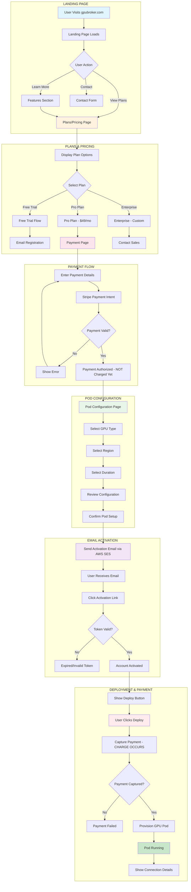
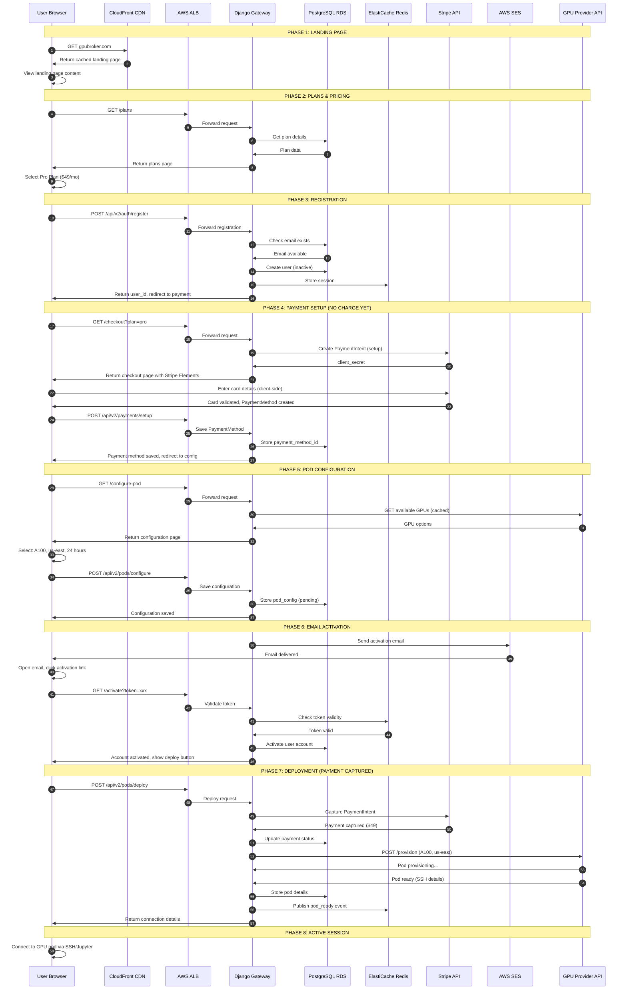

# User Journey 1: Landing Page to GPU Deployment

## Overview

This journey covers the complete conversion funnel from landing page visitor to active GPU rental customer.

**Flow:** Landing Page → Plans → Payment → Pod Confirmation → Email Activation → Deployment

**Infrastructure:** AWS-based (ALB, ECS/EKS, RDS, ElastiCache, SES, Stripe/AWS Payment)

---

## Journey Flow Diagram

---

## Sequence Diagram

---

## Screen Details

