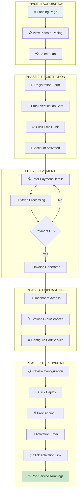
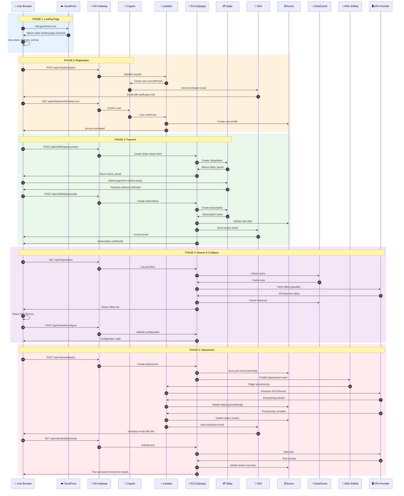

# Journey 1: New User - Landing Page to First GPU/Service Deployment

## Complete SaaS Flow for GPUBROKER

**Platform Type:** Full SaaS with 100% AWS Serverless Infrastructure
**Authentication:** Django + AWS Cognito
**Payment:** Stripe (Sandbox/Live modes)
**Deployment:** AWS Lambda, API Gateway, ECS Fargate, MSK, MWAA

---

## DEPLOYMENT MODES

| Mode | Description | Use Case |
|------|-------------|----------|
| **SANDBOX** | Test environment, no real charges | Development, Testing, Demo |
| **LIVE** | Production environment, real billing | Production users |

---

## High-Level User Journey Flow



---

## Complete Sequence Diagram



---

## Screen-by-Screen Details


### SCREEN 1: Landing Page

```
┌─────────────────────────────────────────────────────────────────────────────┐
│  🌐 GPUBROKER - Landing Page                                    [Login]     │
├─────────────────────────────────────────────────────────────────────────────┤
│                                                                             │
│  ┌─────────────────────────────────────────────────────────────────────┐   │
│  │                         HERO SECTION                                 │   │
│  │                                                                      │   │
│  │     🚀 GPU BROKER                                                    │   │
│  │     Access ANY GPU from ANY Provider                                 │   │
│  │     One Platform. Best Prices. Instant Deployment.                   │   │
│  │                                                                      │   │
│  │     [  Get Started Free  ]    [  View Pricing  ]                     │   │
│  │                                                                      │   │
│  └─────────────────────────────────────────────────────────────────────┘   │
│                                                                             │
│  ┌─────────────────────────────────────────────────────────────────────┐   │
│  │                         FEATURES                                     │   │
│  │                                                                      │   │
│  │  ┌─────────────┐  ┌─────────────┐  ┌─────────────┐  ┌─────────────┐ │   │
│  │  │ 🔍 Compare  │  │ 💰 Best     │  │ ⚡ Instant  │  │ 🤖 AI       │ │   │
│  │  │ 20+ Provid. │  │ Prices      │  │ Deploy      │  │ Agents      │ │   │
│  │  └─────────────┘  └─────────────┘  └─────────────┘  └─────────────┘ │   │
│  └─────────────────────────────────────────────────────────────────────┘   │
│                                                                             │
│  ┌─────────────────────────────────────────────────────────────────────┐   │
│  │                         PROVIDERS                                    │   │
│  │                                                                      │   │
│  │  [RunPod] [Vast.ai] [AWS] [Azure] [GCP] [Lambda] [+15 more]         │   │
│  │                                                                      │   │
│  └─────────────────────────────────────────────────────────────────────┘   │
│                                                                             │
│  ┌─────────────────────────────────────────────────────────────────────┐   │
│  │                         LIVE PRICING                                 │   │
│  │                                                                      │   │
│  │  GPU Type      │ Best Price │ Provider  │ Availability              │   │
│  │  ─────────────────────────────────────────────────────               │   │
│  │  RTX 4090      │ $0.35/hr   │ Vast.ai   │ ████████░░ 80%            │   │
│  │  A100 80GB     │ $1.89/hr   │ RunPod    │ ██████████ 100%           │   │
│  │  H100          │ $2.49/hr   │ Lambda    │ ██████░░░░ 60%            │   │
│  │                                                                      │   │
│  │  [  View All GPUs  ]                                                 │   │
│  └─────────────────────────────────────────────────────────────────────┘   │
│                                                                             │
│  ┌─────────────────────────────────────────────────────────────────────┐   │
│  │                         CTA                                          │   │
│  │                                                                      │   │
│  │     Ready to start? Create your free account now.                    │   │
│  │                                                                      │   │
│  │     [  Sign Up Free - No Credit Card Required  ]                     │   │
│  │                                                                      │   │
│  └─────────────────────────────────────────────────────────────────────┘   │
│                                                                             │
│  Footer: About | Docs | API | Status | Terms | Privacy | Contact           │
└─────────────────────────────────────────────────────────────────────────────┘
```

**Screen 1 - Technical Details:**

| Element | API Call | AWS Service |
|---------|----------|-------------|
| Page Load | Static from S3 | CloudFront CDN |
| Live Pricing | `GET /api/v2/providers/featured` | API Gateway → ECS |
| Provider Logos | Static assets | S3 + CloudFront |

---

### SCREEN 2: Plans & Pricing

```
┌─────────────────────────────────────────────────────────────────────────────┐
│  🌐 GPUBROKER - Plans & Pricing                          [Login] [Sign Up]  │
├─────────────────────────────────────────────────────────────────────────────┤
│                                                                             │
│  ┌─────────────────────────────────────────────────────────────────────┐   │
│  │                         CHOOSE YOUR PLAN                             │   │
│  │                                                                      │   │
│  │     [ Monthly ]  [ Annual - Save 20% ]                               │   │
│  │                                                                      │   │
│  └─────────────────────────────────────────────────────────────────────┘   │
│                                                                             │
│  ┌───────────────────┐ ┌───────────────────┐ ┌───────────────────┐         │
│  │       FREE        │ │       PRO         │ │    ENTERPRISE     │         │
│  │                   │ │    ⭐ POPULAR     │ │                   │         │
│  │     $0/month      │ │    $49/month      │ │   Custom Pricing  │         │
│  │                   │ │                   │ │                   │         │
│  │  ✓ 10 API calls/s │ │  ✓ 100 API/s      │ │  ✓ 1000+ API/s    │         │
│  │  ✓ Basic GPUs     │ │  ✓ All GPUs       │ │  ✓ All GPUs       │         │
│  │  ✓ Email support  │ │  ✓ Priority supp. │ │  ✓ Dedicated supp.│         │
│  │  ✓ 1 concurrent   │ │  ✓ 10 concurrent  │ │  ✓ Unlimited      │         │
│  │  ✗ WebSocket      │ │  ✓ WebSocket      │ │  ✓ WebSocket      │         │
│  │  ✗ Webhooks       │ │  ✓ Webhooks       │ │  ✓ Webhooks       │         │
│  │  ✗ AI Agents      │ │  ✓ AI Agents      │ │  ✓ Custom Agents  │         │
│  │  ✗ SSO            │ │  ✗ SSO            │ │  ✓ SSO/SAML       │         │
│  │                   │ │                   │ │                   │         │
│  │  [ Get Started ]  │ │  [ Start Trial ]  │ │  [ Contact Sales ]│         │
│  │                   │ │   14 days free    │ │                   │         │
│  └───────────────────┘ └───────────────────┘ └───────────────────┘         │
│                                                                             │
│  ┌─────────────────────────────────────────────────────────────────────┐   │
│  │                         FEATURE COMPARISON                           │   │
│  │                                                                      │   │
│  │  Feature              │ Free    │ Pro     │ Enterprise              │   │
│  │  ─────────────────────────────────────────────────────               │   │
│  │  API Rate Limit       │ 10/s    │ 100/s   │ 1000+/s                 │   │
│  │  Concurrent Pods      │ 1       │ 10      │ Unlimited               │   │
│  │  Real-time Updates    │ ✗       │ ✓       │ ✓                       │   │
│  │  Price Alerts         │ ✗       │ ✓       │ ✓                       │   │
│  │  AI Agent Access      │ ✗       │ ✓       │ ✓ + Custom              │   │
│  │  Bulk Operations      │ ✗       │ ✓       │ ✓                       │   │
│  │  SLA                  │ ✗       │ 99.9%   │ 99.99%                  │   │
│  │  Support              │ Email   │ Priority│ Dedicated               │   │
│  │                                                                      │   │
│  └─────────────────────────────────────────────────────────────────────┘   │
│                                                                             │
│  ┌─────────────────────────────────────────────────────────────────────┐   │
│  │                         FAQ                                          │   │
│  │                                                                      │   │
│  │  ▶ What payment methods do you accept?                               │   │
│  │  ▶ Can I change plans later?                                         │   │
│  │  ▶ Is there a free trial?                                            │   │
│  │  ▶ How does billing work for GPU usage?                              │   │
│  │                                                                      │   │
│  └─────────────────────────────────────────────────────────────────────┘   │
│                                                                             │
└─────────────────────────────────────────────────────────────────────────────┘
```

**Screen 2 - Technical Details:**

| Element | API Call | AWS Service |
|---------|----------|-------------|
| Plan Data | `GET /api/v2/billing/plans` | API Gateway → Lambda |
| Select Plan | `POST /api/v2/billing/select-plan` | API Gateway → Lambda |
| Stripe Prices | Cached from Stripe | ElastiCache |


---

### SCREEN 3: Registration Form

```
┌─────────────────────────────────────────────────────────────────────────────┐
│  🌐 GPUBROKER - Create Account                                              │
├─────────────────────────────────────────────────────────────────────────────┤
│                                                                             │
│  ┌─────────────────────────────────────────────────────────────────────┐   │
│  │                                                                      │   │
│  │     ┌─────────────────────────────────────────────────────────┐     │   │
│  │     │                                                          │     │   │
│  │     │     🚀 Create Your GPUBROKER Account                     │     │   │
│  │     │                                                          │     │   │
│  │     │     Selected Plan: PRO ($49/month)                       │     │   │
│  │     │     14-day free trial included                           │     │   │
│  │     │                                                          │     │   │
│  │     │     ─────────────────────────────────────────            │     │   │
│  │     │                                                          │     │   │
│  │     │     Full Name *                                          │     │   │
│  │     │     ┌────────────────────────────────────────┐           │     │   │
│  │     │     │                                        │           │     │   │
│  │     │     └────────────────────────────────────────┘           │     │   │
│  │     │                                                          │     │   │
│  │     │     Email Address *                                      │     │   │
│  │     │     ┌────────────────────────────────────────┐           │     │   │
│  │     │     │                                        │           │     │   │
│  │     │     └────────────────────────────────────────┘           │     │   │
│  │     │                                                          │     │   │
│  │     │     Password *                                           │     │   │
│  │     │     ┌────────────────────────────────────────┐           │     │   │
│  │     │     │ ●●●●●●●●●●●●                           │ 👁        │     │   │
│  │     │     └────────────────────────────────────────┘           │     │   │
│  │     │     ✓ 8+ characters  ✓ Uppercase  ✓ Number               │     │   │
│  │     │                                                          │     │   │
│  │     │     Company (Optional)                                   │     │   │
│  │     │     ┌────────────────────────────────────────┐           │     │   │
│  │     │     │                                        │           │     │   │
│  │     │     └────────────────────────────────────────┘           │     │   │
│  │     │                                                          │     │   │
│  │     │     ☑ I agree to the Terms of Service and Privacy Policy │     │   │
│  │     │                                                          │     │   │
│  │     │     ┌────────────────────────────────────────┐           │     │   │
│  │     │     │         Create Account                 │           │     │   │
│  │     │     └────────────────────────────────────────┘           │     │   │
│  │     │                                                          │     │   │
│  │     │     ─────────────── OR ───────────────                   │     │   │
│  │     │                                                          │     │   │
│  │     │     [ 🔵 Continue with Google ]                          │     │   │
│  │     │     [ ⬛ Continue with GitHub ]                          │     │   │
│  │     │                                                          │     │   │
│  │     │     Already have an account? [Log in]                    │     │   │
│  │     │                                                          │     │   │
│  │     └─────────────────────────────────────────────────────────┘     │   │
│  │                                                                      │   │
│  └─────────────────────────────────────────────────────────────────────┘   │
│                                                                             │
└─────────────────────────────────────────────────────────────────────────────┘
```

**Screen 3 - Technical Details:**

| Element | API Call | AWS Service |
|---------|----------|-------------|
| Form Submit | `POST /api/v2/auth/register` | API Gateway → Lambda → Cognito |
| Google OAuth | Cognito Hosted UI | Cognito Identity Provider |
| GitHub OAuth | Cognito Hosted UI | Cognito Identity Provider |
| Password Validation | Client-side + Server | Lambda |

**API Request:**
```json
POST /api/v2/auth/register
{
  "email": "user@example.com",
  "password": "SecurePass123!",
  "full_name": "John Doe",
  "company": "Acme Inc",
  "plan_id": "pro_monthly",
  "terms_accepted": true
}
```

**API Response:**
```json
{
  "status": "pending_verification",
  "message": "Verification email sent",
  "user_id": "usr_xxx",
  "email": "user@example.com"
}
```

---

### SCREEN 4: Email Verification

```
┌─────────────────────────────────────────────────────────────────────────────┐
│  🌐 GPUBROKER - Verify Your Email                                           │
├─────────────────────────────────────────────────────────────────────────────┤
│                                                                             │
│  ┌─────────────────────────────────────────────────────────────────────┐   │
│  │                                                                      │   │
│  │     ┌─────────────────────────────────────────────────────────┐     │   │
│  │     │                                                          │     │   │
│  │     │                      📧                                  │     │   │
│  │     │                                                          │     │   │
│  │     │           Check Your Email                               │     │   │
│  │     │                                                          │     │   │
│  │     │     We've sent a verification link to:                   │     │   │
│  │     │                                                          │     │   │
│  │     │           user@example.com                               │     │   │
│  │     │                                                          │     │   │
│  │     │     Click the link in the email to verify your           │     │   │
│  │     │     account and continue setup.                          │     │   │
│  │     │                                                          │     │   │
│  │     │     ─────────────────────────────────────────            │     │   │
│  │     │                                                          │     │   │
│  │     │     Didn't receive the email?                            │     │   │
│  │     │                                                          │     │   │
│  │     │     • Check your spam folder                             │     │   │
│  │     │     • Make sure user@example.com is correct              │     │   │
│  │     │                                                          │     │   │
│  │     │     ┌────────────────────────────────────────┐           │     │   │
│  │     │     │         Resend Verification Email      │           │     │   │
│  │     │     └────────────────────────────────────────┘           │     │   │
│  │     │                                                          │     │   │
│  │     │     [Change email address]                               │     │   │
│  │     │                                                          │     │   │
│  │     └─────────────────────────────────────────────────────────┘     │   │
│  │                                                                      │   │
│  └─────────────────────────────────────────────────────────────────────┘   │
│                                                                             │
└─────────────────────────────────────────────────────────────────────────────┘
```

**Email Template (SES):**
```
┌─────────────────────────────────────────────────────────────────────────────┐
│  From: GPUBROKER <noreply@gpubroker.com>                                    │
│  Subject: Verify your GPUBROKER account                                     │
├─────────────────────────────────────────────────────────────────────────────┤
│                                                                             │
│     🚀 GPUBROKER                                                            │
│                                                                             │
│     Hi John,                                                                │
│                                                                             │
│     Welcome to GPUBROKER! Please verify your email address                  │
│     to complete your registration.                                          │
│                                                                             │
│     ┌────────────────────────────────────────┐                              │
│     │         Verify Email Address           │                              │
│     └────────────────────────────────────────┘                              │
│                                                                             │
│     Or copy this link:                                                      │
│     https://gpubroker.com/verify?token=xxx                                  │
│                                                                             │
│     This link expires in 24 hours.                                          │
│                                                                             │
│     If you didn't create this account, please ignore this email.            │
│                                                                             │
│     ─────────────────────────────────────────                               │
│     GPUBROKER - Access ANY GPU from ANY Provider                            │
│                                                                             │
└─────────────────────────────────────────────────────────────────────────────┘
```

**Screen 4 - Technical Details:**

| Element | API Call | AWS Service |
|---------|----------|-------------|
| Resend Email | `POST /api/v2/auth/resend-verification` | API Gateway → Lambda → SES |
| Verify Link | `GET /api/v2/auth/verify?token=xxx` | API Gateway → Lambda → Cognito |

